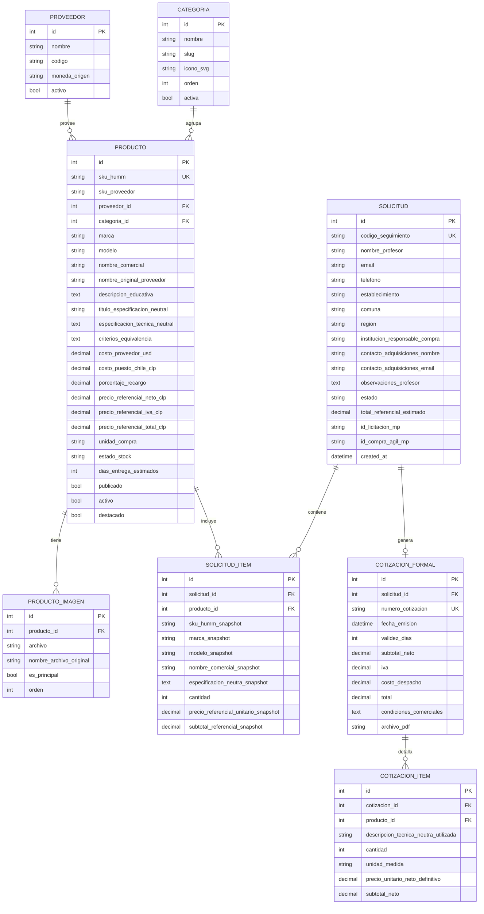
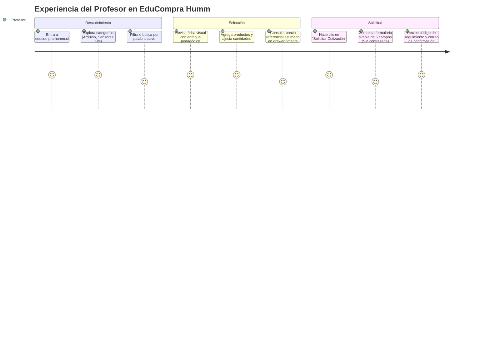

# Plan de Implementación — Fase 0: Arquitectura, Modelo Funcional y Planificación MVP
**Plataforma:** EduCompra Humm (`educompra.humm.cl`)  
**Fecha:** Septiembre 2026  
**Estado:** Propuesta de Arquitectura para Aprobación  
**Versión:** 1.0 — Fase 0

---

## 1. Resumen de Comprensión

### 1.1 El Problema que Resuelve EduCompra
En el ecosistema escolar y técnico-profesional chileno, los docentes y encargados de laboratorios STEM/Maker tienen claridad pedagógica sobre qué tecnologías quieren trabajar con sus estudiantes (Arduino, Raspberry Pi, sensores IoT, robótica educativa, herramientas de prototipado). Sin embargo, se enfrentan a una brecha crítica:
1. **Dificultad de traducción técnica y presupuestaria:** Dificultad para estructurar listas de compra detalladas con componentes compatibles y precios referenciales confiables.
2. **Incompatibilidad con los canales de adquisición institucional:** Los colegios compran a través de sostenedores, corporaciones municipales o DAEM, quienes operan bajo la Ley de Compras Públicas (Ley 19.886 y Mercado Público / Compra Ágil). Estos organismos exigen **especificaciones técnicas neutras**, sin marcas ni modelos comerciales cerrados.
3. **Fricción en la cotización:** Los procesos tradicionales de e-commerce exigen pagos inmediatos con tarjetas o registros forzosos con contraseñas que los profesores abandonan.

**EduCompra Humm resuelve esto actuando como el puente entre el aula y la compra pública:**
$$\text{Profesor Selecciona} \longrightarrow \text{Humm Organiza y Valida} \longrightarrow \text{Humm Cotiza Formalmente} \longrightarrow \text{Establecimiento Compra / Licita}$$

### 1.2 Usuarios Principales
*   **Usuario Principal (Demandante):** Profesores, coordinadores pedagógicos y jefes de taller de colegios y liceos. Acceden desde teléfonos móviles o computadores de sala de clases. Requieren navegación rápida, visual, sin barreras técnicas ni solicitud de contraseñas.
*   **Usuario Secundario (Comprador/Gestor):** Encargados de adquisiciones, administradores de colegios y DAEM. Reciben la cotización formal de Humm y el anexo de especificaciones técnicas neutras para preparar bases o licitaciones.
*   **Usuario Interno (Humm):** Equipo comercial y de operaciones de Humm. Gestiona solicitudes, valida stock y tiempos de internación, ajusta costos y emite cotizaciones formales.

### 1.3 Flujo Principal y Regla de Neutralidad Documental
```
[Catálogo Público Curado] 
         │
         ▼
[Profesor selecciona productos y cantidades] (Sin registro/login)
  Vista Profesor: Marca + Modelo + Fotografía + Descripción Educativa
         │
         ▼
[Lista de Cotización con Precios Referenciales Sugeridos]
         │
         ▼
[Formulario mínimo de contacto y establecimiento]
         │
         ▼
[Registro de Solicitud en EduCompra + Snapshot Histórico Inmutable]
  Snapshot: SKU Humm + Marca + Modelo + Nombre Comercial + Especificación Neutra + Precio Ref.
         │
         ▼
[Revisión comercial y operativa Humm] (Disponibilidad, flete, costos)
  Ajuste manual de Precios Definitivos a partir del Precio Sugerido
         │
         ▼
[Emisión de Documentos Externos Estrictamente Neutros]
  • Cotización Formal: Descripción Técnica Neutra + Cantidad + Unidad + Precios (Sin marca/modelo)
  • Documentación Mercado Público: Especificación Técnica Neutra + Criterios de Equivalencia
```

> **REGLA OBLIGATORIA DE NEUTRALIDAD DOCUMENTAL:**  
> La marca y el modelo comercial pueden mostrarse al profesor dentro del catálogo EduCompra y deben conservarse internamente en Humm para trazabilidad operativa de despacho. Sin embargo, **toda cotización formal entregada al establecimiento y toda documentación preparada para apoyar una compra pública debe utilizar descripciones técnicas neutras**. No se debe incorporar automáticamente marca, modelo ni SKU de proveedor en documentos externos.

### 1.4 Lo que NO es la Plataforma
*   **NO es un e-commerce tradicional:** No dispone de pasarela de pago en línea (Webpay, Flow, Mercado Pago) ni promesa de despacho transaccional automático.
*   **NO reemplaza a Mercado Público:** No transacciona licitaciones ni adjudicaciones directamente dentro de la plataforma. Prepara los antecedentes técnicos y comerciales para que el establecimiento ejecute el proceso donde corresponda.
*   **NO es un marketplace abierto:** No permite la publicación de vendedores externos; es un catálogo exclusivo curado y respaldado por Humm.
*   **NO es el volcado automático de 966 productos:** El archivo maestro de Keyestudio es una base de abastecimiento; el catálogo público de EduCompra mantendrá inicialmente solo una selección curada de 50 a 100 productos activos.

---

## 2. Arquitectura Propuesta y Justificación Técnica

### 2.1 Stack Tecnológico Recomendado
Tras analizar la infraestructura existente de Humm en HostGator (donde ya operan plataformas de producción bajo **Python + Apache + Phusion Passenger** con virtualenv gestionado con `uv`, así como entornos LAMP nativos), se evalúan dos alternativas:

| Criterio | Opción A: Django (Python 3.11) *(Recomendada)* | Opción B: PHP 8.x + MariaDB (Vanilla/Custom) |
| :--- | :--- | :--- |
| **Panel de Administración** | **Nativo, robusto y seguro** (Django Admin con filtros, búsqueda, acciones masivas y auditoría sin costo de desarrollo). | Requiere construir desde cero autenticación, RBAC, CRUDs y validaciones. |
| **Seguridad de Serie** | Protección CSRF, XSS, SQL Injection y hashing PBKDF2/Argon2 integrados por defecto. | Debe programarse y auditarse manualmente cada punto de entrada. |
| **Manejo de Datos y Excel** | Integración nativa con `openpyxl` / `pandas` para importaciones robustas y manipulación de 966 filas. | Librerías como `PhpSpreadsheet` demandan alto consumo de memoria en PHP. |
| **Despliegue en HostGator** | **100% probado en producción Humm** (`fogata.humm.cl` vía GitHub Actions + SSH + Passenger reload). | Despliegue simple por FTP/Git, pero mayor dispersión de código backend. |
| **Generación de Documentos** | Soporte directo para generación de PDF (`WeasyPrint` / `ReportLab`) y Excel estructurado. | `TCPDF` / `Dompdf` en PHP (funcional pero con mayores limitaciones de renderizado CSS). |

> **Decisión Justificada:** Se propone **Django (Python 3.10+)** con backend de base de datos **MySQL / MariaDB** (y SQLite para suite de pruebas locales). Permite entregar un MVP seguro, con backoffice completo desde el día 1, reutilizando exactamente el pipeline de CI/CD ya validado en HostGator.

### 2.2 Componentes de la Arquitectura
*   **Frontend:**
    *   Arquitectura Server-Side Rendering (SSR) mediante plantillas Django HTML5 semánticas.
    *   **Vanilla CSS Moderno:** Sin dependencias de frameworks pesados (evitando Node.js en servidor de producción). Uso de CSS Custom Properties (variables de diseño del ecosistema Humm), CSS Grid, Flexbox y media queries Mobile-First.
    *   **Vanilla JavaScript (ES6+):** Script ligero y sin dependencias para:
        *   Gestión de la lista de cotización en memoria del cliente (`localStorage`) como respaldo ante navegación o recarga.
        *   Cajón / Drawer lateral flotante para revisar la lista de cotización en tiempo real sin recargar página.
        *   Actualización reactiva de cantidades y cálculo de subtotales referenciales.
*   **Backend:**
    *   Estructura modular en Django:
        *   `apps/catalogo/`: Modelos de producto, categorías, imágenes y vistas públicas del catálogo.
        *   `apps/cotizaciones/`: Carrito/lista de cotización, lógica de pricing referencial, recepción de solicitudes públicas y confirmaciones por email.
        *   `apps/gestion/`: Panel administrativo de seguimiento operativo de solicitudes, cambio de estados y reportería.
        *   `apps/importador/`: Comandos y vistas administrativas para ingesta y actualización no destructiva desde Excel Keyestudio.
*   **Base de Datos:**
    *   **MariaDB / MySQL** provisto nativamente por cPanel en HostGator.
    *   Codificación UTF8MB4 para soporte pleno de caracteres en español y símbolos técnicos.
*   **Almacenamiento y Optimización de Imágenes:**
    *   Directorio en servidor: `media/catalogo/originales/<SKU>.<ext>`.
    *   Procesamiento con librería **Pillow**: Generación de miniaturas optimizadas para web en formato WebP / JPG progresivo en `media/catalogo/thumbs/` para garantizar tiempos de carga inferiores a 1 segundo en redes móviles.
*   **Generación Futura de Documentos:**
    *   **Cotización Humm (PDF):** Plantilla HTML estilizada convertida a PDF con cabecera institucional Humm, desglose de ítems, condiciones de despacho y vigencia.
    *   **Ficha de Especificación Técnica Neutra (PDF/Word):** Generación automática de términos técnicos sin marcas para presentar a compras públicas.
    *   **Excel de Adquisición:** Generado mediante `openpyxl` con tablas preformateadas para facilitar el trabajo del área de adquisiciones del colegio.
*   **Estructura de Despliegue en HostGator:**
    *   Subdominio: `educompra.humm.cl` apuntando a `/home1/paulocis/educompra.humm.cl`.
    *   Directorio de aplicación: `/home1/paulocis/apps/educompra/app`.
    *   Directorio virtualenv: `/home1/paulocis/apps/educompra/venv` administrado con `uv`.
    *   Variables de entorno seguras: `/home1/paulocis/apps/educompra/secrets/.env` fuera del document root web.
    *   Reinicio de servidor mediante Phusion Passenger: `touch tmp/restart.txt`.

---

## 3. Compatibilidad con Infraestructura HostGator

### 3.1 Verificación de Capacidades en Servidor
El servidor de producción Humm en HostGator cuenta con las siguientes características comprobadas operativamente:
1. **Servidor Web:** Apache 2.4 con módulo Phusion Passenger para aplicaciones Python WSGI.
2. **Entorno Python:** Soporte para Python 3.10+ y disponibilidad de `uv` en `/home1/paulocis/.local/bin/uv` para instalación de paquetes ultra-rápida sin saturar límites de proceso.
3. **Base de Datos:** Servidor MySQL / MariaDB local (`localhost:3306`), administrable vía cPanel y phpMyAdmin.
4. **Almacenamiento y Permisos:** Espacio en disco suficiente para alojar el catálogo de imágenes (~950 archivos en baja y media resolución requieren entre 150 MB y 300 MB).
5. **Automatización:** Soporte para despliegue automatizado vía SSH desde GitHub Actions (`appleboy/ssh-action`), ejecutando migraciones y recolección de estáticos sin intervención manual.

### 3.2 Riesgos Identificados en Hosting Compartido y Mitigaciones

| Riesgo Técnico en HostGator | Causa Potencial | Estrategia de Mitigación |
| :--- | :--- | :--- |
| **Timeout en importación masiva** | La lectura de 966 filas de Excel y procesamiento de imágenes excede el límite de ejecución HTTP (30–60 seg). | La importación masiva inicial o de actualización se diseñará para ejecutarse prioritariamente vía **comando de terminal CLI (`python manage.py importar_catalogo`)** o mediante lotes pequeños paginados con barra de progreso en web. |
| **Límite de memoria en Pillow** | Redimensionar 900 imágenes de golpe puede agotar la cuota de memoria RAM asignada al proceso cPanel. | Procesamiento perezoso (on-demand / lazy generation) o redimensionamiento por lotes en segundo plano con liberación explícita de memoria. |
| **Bloqueo de archivos estáticos** | Passenger en Apache a veces retiene caché de archivos `.css` o `.js`. | Implementación de `ManifestStaticFilesStorage` en Django para añadir hashes únicos a cada archivo (`styles.abc123.css`), forzando refresco inmediato en clientes. |
| **Permisos en carpeta `media/`** | Imágenes subidas o generadas quedan con permisos incorrectos impidiendo su lectura por Apache. | Configuración explícita de `FILE_UPLOAD_PERMISSIONS = 0o644` y `FILE_UPLOAD_DIRECTORY_PERMISSIONS = 0o755` en `settings.py`. |

---

## 4. Modelo Preliminar de Datos

El diseño relacional garantiza integridad referencial, trazabilidad de costos e independencia total entre la presentación comercial al docente y la especificación neutra institucional.



### 4.1 Entidad Parámetros de Pricing (`ConfiguracionPricing`) y Modelo de Precios
Modelo singleton administrable para evitar valores rígidos en el código:
*   `tipo_cambio_usd_clp`: Tipo de cambio de referencia (ej: $950 CLP).
*   `recargo_general_porcentaje`: Recargo comercial Humm sugerido (ej: `80.00`%). **Parámetro administrable, nunca codificado rígidamente.**
*   `factor_internacion_flete_porcentaje`: Factor estimado de flete e internación (ej: `15.00`%).
*   `iva_porcentaje`: Impuesto de referencia (ej: `19.00`%).
*   `email_notificaciones_humm`: Casilla que recibe avisos de nuevas cotizaciones.

> **CRITERIO DE PRICING (PRECIO SUGERIDO vs. PRECIO DEFINITIVO):**  
> Los cálculos automáticos de tipo de cambio, internación, costo base y recargo general generan un **PRECIO SUGERIDO** referencial en el catálogo. Al preparar una cotización formal, el administrador Humm tiene la potestad de ajustar o sobrescribir manualmente el precio unitario definitivo de cada producto según volumen, disponibilidad o condiciones específicas de la negociación.

---

## 5. Separación Estructural: Producto Comercial vs. Especificación Técnica Neutra

Esta regla constituye un pilar estratégico de EduCompra:

### 5.1 El Desafío Normativo en ChileCompra
En compras del Estado chileno (Licitaciones Públicas, Tratos Directos y Compras Ágiles bajo la plataforma Mercado Público), el artículo 22 del Reglamento de la Ley 19.886 prohíbe taxativamente la exigencia de marcas o patentes exclusivas salvo justificación técnica excepcional. Exigir explícitamente "Keyestudio KS0123" genera observaciones legales y eventuales impugnaciones de proveedores competidores.

### 5.2 Solución Arquitectónica
El producto en EduCompra mantiene internamente una **doble representación vinculada**:

```
                              ┌────────────────────────────────────────┐
                              │           PRODUCTO EN BD               │
                              │     SKU Humm: HUMM-SEN-0102            │
                              │  SKU Proveedor: KS0011 (Keyestudio)    │
                              └──────────────────┬─────────────────────┘
                                                 │
                   ┌─────────────────────────────┴─────────────────────────────┐
                   ▼                                                           ▼
       [VISTA PROFESOR / FRONTEND]                                 [VISTA COMPRA PÚBLICA / DOCS]
  • Marca: Keyestudio                                         • Título Neutro: Sensor de humedad de suelo
  • Modelo: KS0011                                            • Especificación: Módulo sensor higrométrico
  • Foto: Imagen comercial clara                                para suelo con electrodos niquelados,
  • Enfoque Pedagógico: "¿Cómo funciona?                        salida analógica (0-5V) y digital con
    Permite a los estudiantes medir el nivel                     umbral ajustable vía potenciómetro,
    de agua en tierra para proyectos de                          voltaje de operación 3.3V-5V.
    huerto automatizado con Arduino."                         • Cláusula de Equivalencia: "...o producto
  • Precio Referencial: $3.990 CLP                              técnicamente equivalente compatible".
```

*   **En la plataforma pública:** El profesor busca y selecciona con base en marcas y fotografías claras.
*   **En el motor de exportación de documentos:** Humm puede emitir con un solo clic dos documentos complementarios:
    1. **Cotización Comercial Humm:** Con el detalle comercial de los productos seleccionados y precios formales.
    2. **Anexo Técnico de Términos de Referencia (TDR):** Con las especificaciones neutras redactadas para que el DAEM o encargado de compras las copie directamente a Mercado Público.
*   **Trazabilidad Garantizada:** Aunque la compra pública se publique de forma neutra, Humm conserva el registro exacto del SKU de origen para despachar el producto correcto tras la adjudicación.

---

## 6. Estrategia de Catálogo, Imágenes e Importación

### 6.1 Tratamiento del Catálogo Maestro de Abastecimiento (Keyestudio)
*   **Total de Registros:** ~966 ítems (~945 SKUs únicos).
*   **Principio:** El archivo Excel original representa el *catálogo de abastecimiento mayorista*, no el catálogo público.
*   **Estado por Defecto:** Al cargarse en base de datos, todo producto nuevo queda con el flag `publicado = False`.
*   **Curaduría Progresiva:** Solo los productos seleccionados y enriquecidos pedagógicamente por Humm tendrán `publicado = True` (iniciando con un lote de 50 a 100 productos en el MVP).

### 6.2 Relación Automática Catálogo ↔ Imágenes
*   **Regla de Coincidencia:** Los archivos de imágenes están nombrados según el SKU del fabricante (ej: `KS0123.jpg`, `KS0123.png`, `KS0123.webp`).
*   **Algoritmo de Vinculación:**
    1. Normalización del SKU: Conversión a mayúsculas y eliminación de espacios en blanco (`strip().upper()`).
    2. Inspección del directorio de imágenes buscando coincidencias con extensiones soportadas en orden de prioridad: `.webp`, `.png`, `.jpg`, `.jpeg`.
    3. Si existe coincidencia: Se crea el registro en `ProductoImagen` y se asigna como imagen principal.
    4. Si no existe imagen: El producto queda registrado con un indicador interno `sin_imagen = True` y utiliza un placeholder estilizado del ecosistema Humm en la vista de administración.

### 6.3 Importación y Actualización No Destructiva (Upsert Inteligente)
Cuando Humm reciba futuras versiones actualizadas del Excel del proveedor, el importador operará bajo reglas estrictas de preservación de valor:

```
Para cada registro en el Excel:
  │
  ├─► ¿Existe el SKU Proveedor en BD?
  │      │
  │      ├─► NO: Crear nuevo producto con:
  │      │        • publicado = False
  │      │        • Datos técnicos base del fabricante
  │      │        • Costo USD actualizado
  │      │
  │      └─► SÍ: Actualizar ÚNICAMENTE:
  │               • costo_proveedor_usd
  │               • fecha_actualizacion_costo
  │               • Recalcular precios referenciales sugeridos
  │
  └─► PRESERVAR INTACTO (NO SOBRESCRIBIR):
         • nombre_comercial (editado por Humm)
         • descripcion_educativa (redactada por Humm)
         • titulo_especificacion_neutral (curada por Humm)
         • especificacion_tecnica_neutral (curada por Humm)
         • categoria_id y subcategoria_id
         • estado publicado (Sí/No)
```

---

## 7. Flujo de Usuario (Profesor / Demandante)

Diseñado con filosofía **Mobile-First** y **cero barreras de fricción**:



### 7.1 Pasos Detallados de UX
1.  **Portada Educativa:** Mensaje claro y empático: *"Tecnología para llevar tus proyectos educativos a la realidad. Selecciona los componentes para tus estudiantes; Humm prepara la cotización y los antecedentes técnicos para la compra de tu colegio."*
2.  **Buscador y Filtros Intuitivos:** Búsqueda rápida por nombre cotidiano (ej: "sensor de humedad", "cable jumper", "kit robótica").
3.  **Ficha de Producto Orientada a Docentes:**
    *   Fotografía de alta calidad.
    *   Explicación pedagógica: qué proyecto se puede armar con este producto.
    *   Compatibilidad explícita (ej: "Compatible con Arduino Uno, Nano y ESP32").
    *   Precio referencial en pesos chilenos (IVA incluido o desglose claro).
4.  **Lista Flotante de Cotización (Drawer / Botón persistente):**
    *   Contador visible de ítems seleccionados en la esquina de la pantalla.
    *   Panel deslizable que permite modificar cantidades o eliminar ítems sin perder la posición en la página.
    *   Cálculo automático del total referencial estimado.
    *   Leyenda de transparencia: *"Los valores son referenciales. Humm confirmará disponibilidad y precio definitivo en tu cotización formal."*
5.  **Formulario de Solicitud en 1 Solo Paso:**
    *   Nombre completo.
    *   Email de contacto (donde se enviará la cotización).
    *   Teléfono / WhatsApp (para dudas técnicas rápidas del equipo Humm).
    *   Establecimiento educacional, Comuna y Región.
    *   *(Opcional)* Nombre del encargado de compras o DAEM.
    *   *(Opcional)* Observaciones o fecha estimada de uso en clases.
    *   **Sin creación de cuentas, sin claves, sin reCAPTCHA invasivo (protección por Honeypot invisible).**
6.  **Pantalla de Confirmación Inmediata:**
    *   Mensaje de éxito con número correlativo (ej: `SOL-2026-0045`).
    *   Envío instantáneo de correo copia al profesor con el detalle de lo solicitado.

---

## 8. Flujo Administrativo (Equipo Humm)

```
[Nueva Solicitud]
       │
       ▼
[Revisión Técnica y de Stock]
 (Humm revisa disponibilidad local o tiempo de importación)
       │
       ▼
[Ajuste de Condiciones Comerciales]
 (Ajuste de precio final, flete a región, descuentos por volumen)
       │
       ▼
[Generación de Cotización Formal + Especificación Neutra]
 (Generación de PDF oficial y asignación de código COT-HUMM-XXXX)
       │
       ▼
[Envío al Establecimiento y Notificación al Profesor]
       │
       ▼
[Seguimiento de Compra] 
 (Espera de proceso -> Publicación en Mercado Público -> Adjudicación)
       │
       ▼
[Cierre y Despacho]
```

### 8.1 Estados Operacionales de la Solicitud
1.  `nueva`: Solicitud recibida desde la web, pendiente de triaje.
2.  `en_revision`: Equipo Humm evaluando disponibilidad, costos de flete o internación.
3.  `cotizacion_preparada`: Cotización generada internamente con precios comerciales definitivos.
4.  `cotizacion_enviada`: Cotización formal despachada por correo al profesor y encargado de compras.
5.  `esperando_proceso_compra`: Establecimiento tramitando presupuesto interno o autorización de DAEM/Sostenedor.
6.  `proceso_publicado`: Compra publicada en Mercado Público (Compra Ágil o Licitación Menor).
7.  `oferta_presentada`: Humm postuló su oferta en la plataforma estatal.
8.  `adjudicada`: Proceso adjudicado a Humm.
9.  `orden_compra_recibida`: Orden de Compra oficial emitida por el comprador público.
10. `en_preparacion`: Preparación de bodega y embalaje.
11. `despachada`: Pedido entregado al transporte con número de seguimiento.
12. `cerrada`: Proceso concluido exitosamente con recepción conforme.
13. `cancelada_perdida`: No prosperó (con registro de motivo comercial para estadísticas).

---

## 9. Estructura del Administrador Humm

El panel de administración privado contará con los siguientes módulos esenciales:

### 9.1 Bandeja de Solicitudes y Cotizaciones
*   Listado general filtrable por estado, fecha, región y establecimiento.
*   Buscador por nombre de profesor, email o código de seguimiento.
*   **Ficha 360° de la Solicitud:**
    *   Datos del solicitante y colegio.
    *   Tabla de productos solicitados con posibilidad de ajustar cantidades, agregar ítems adicionales o aplicar descuentos.
    *   Bitácora de notas internas (comentarios privados entre miembros del equipo Humm).
    *   Historial de cambios de estado y fechas.
    *   Acción de un clic: "Emitir Cotización Formal".

### 9.2 Gestión de Catálogo y Curaduría
*   Tabla de productos con filtros rápidos: `Publicado (Sí/No)`, `Con Imagen (Sí/No)`, `Categoría`, `Estado de Stock`.
*   Interruptor rápido (toggle switch) para publicar o despublicar productos inmediatamente.
*   Editor de producto con doble panel:
    *   *Panel Izquierdo:* Nombre comercial, marca, categoría, descripción educativa orientada al aula.
    *   *Panel Derecho:* Título neutro, especificación técnica neutra y cláusula de equivalencia técnica.
*   Galería de imágenes: reordenar fotos y marcar foto de portada.

### 9.3 Gestor de Parámetros y Precios
*   Configuración del tipo de cambio oficial de trabajo (USD → CLP).
*   Factor de recargo general configurable (ej: 80% / factor 1.80).
*   Configuración de días de validez por defecto de las cotizaciones (ej: 30 días corridos).
*   Plantillas de textos legales y condiciones de despacho.

### 9.4 Módulo de Carga e Importación Excel
*   Subida de archivo Excel maestro de proveedores.
*   Modo "Simulación" (Dry Run): Permite previsualizar cuántos productos son nuevos, cuántos actualizarán precio y cuántas imágenes fueron vinculadas antes de confirmar la escritura en la base de datos.
*   Reporte de consistencia y alertas de registros con datos faltantes.

---

## 10. Roadmap de Desarrollo

Proponemos una secuencia estructurada y progresiva para garantizar entregas funcionales comprobables en cada etapa:

```
Fase 0 (Actual) ──► Fase 1 ──► Fase 2 ──► Fase 3 ──► Fase 4 ──► Fase 5 ──► Fase 6 / Futura
 Arquitectura y      Base       Motor      Curaduría    Frontend    Documentos   Integración HCC y
 Planificación    Infraest.    Catálogo    Inicial      Público y     y PDF      Mercado Público
                  HostGator   e Imágenes  (50-100 p.)  Cotizador
```

### Detalle de Fases:
*   **Fase 0 — Arquitectura, Modelo Funcional y Planificación MVP *(En curso)*:**
    *   Alineación de requerimientos, modelo conceptual de datos, estrategia de hosting y validación del plan.
*   **Fase 1 — Base Funcional & Infraestructura HostGator:**
    *   Creación del repositorio Git y estructura del proyecto Django.
    *   Configuración del subdominio `educompra.humm.cl` en cPanel HostGator.
    *   Aprovisionamiento de base de datos MySQL en producción y configuración de `.env`.
    *   Implementación de pipeline CI/CD vía GitHub Actions (despliegue automático y reload de Passenger al hacer push a `main`).
    *   Configuración de usuarios administradores con autenticación segura.
*   **Fase 2 — Motor de Catálogo, Almacenamiento de Imágenes e Importación Maestro:**
    *   Estructura de modelos en base de datos (`Producto`, `Categoria`, `ProductoImagen`, `ConfiguracionPricing`).
    *   Comando administrativo de importación de Excel Keyestudio con cálculo dinámico de precios referenciales.
    *   Mapeo automatizado de imágenes por SKU y generación de thumbnails optimizados con Pillow.
*   **Fase 3 — Curaduría y Enriquecimiento del Catálogo Piloto (50 a 100 productos):**
    *   Habilitación del panel de curaduría para Humm.
    *   Selección del catálogo inicial de 50–100 productos clave para robótica y educación tecnológica.
    *   Redacción de descripciones educativas y especificaciones técnicas neutras para este lote inicial.
    *   Activación de publicación (`publicado = True`).
*   **Fase 4 — Frontend Público Mobile-First & Cotizador sin Fricción:**
    *   Desarrollo de interfaz pública responsive (Home, Buscador, Categorías, Ficha de Producto).
    *   Implementación de la lista flotante de cotización (Drawer interactivo en Vanilla JS).
    *   Formulario de solicitud de cotización sin registro y pantalla de éxito.
    *   Envío de correos transaccionales automatizados (notificación a Humm y acuse de recibo al profesor).
*   **Fase 5 — Bandeja Operativa y Motor de Generación de Documentos:**
    *   Bandeja administrativa de seguimiento de solicitudes y gestión de estados.
    *   Motor de generación de **Cotización Formal Humm (PDF)**.
    *   Motor de generación de **Ficha Técnica Neutra para Compra Pública (PDF / Excel)**.
*   **Fase 6 — Integración Futura con Humm Control Center (HCC):**
    *   Modelo de sincronización para transformar solicitudes aprobadas en oportunidades comerciales dentro del CRM/HCC de Humm.
*   **Fase Futura — Integración con Mercado Público:**
    *   Seguimiento y vinculación directa con IDs de licitaciones y Compra Ágil.

---

## 11. Matriz Integral de Riesgos y Mitigaciones

| Categoría | Riesgo Identificado | Impacto | Probabilidad | Estrategia de Mitigación |
| :--- | :--- | :---: | :---: | :--- |
| **Seguridad** | Ataques de spam en formulario de cotización sin registro. | Medio | Alta | Implementación de campo trampa (*honeypot*) invisible para bots y limitación de tasa (*rate-limiting*) por IP. Sin fricción de captchas para profesores reales. |
| **Precios** | Variación brusca del tipo de cambio USD/CLP o inflación en fletes. | Alto | Media | Todas las vistas públicas indican explícitamente **"Precio Referencial"**. La validez del precio formal queda fijada en la cotización emitida por Humm (15 a 30 días de vigencia). Parámetro de tipo de cambio actualizable desde el admin en un clic. |
| **Catálogo** | Inconsistencias de nombres en archivos de fotos (ej: `KS0123 .JPG` vs `ks0123.jpg`). | Medio | Alta | Normalización robusta en código: limpieza de espacios, comparación insensible a mayúsculas/minúsculas y reporte de huérfanos durante la importación. |
| **Legal / MP** | Que una cotización neutra contenga inadvertidamente marcas de fabricante que invaliden una licitación. | Alto | Baja | Validación visual en el panel de Humm: los campos "Comercial" y "Neutro" se presentan claramente diferenciados y el generador de términos de referencia sólo toma el campo neutro validado. |
| **Técnico** | Sobrecarga de memoria en hosting compartido al navegar el catálogo. | Medio | Baja | Paginación estricta de productos (ej: 24 ítems por página), carga diferida de imágenes (*lazy loading* nativo HTML5) e imágenes comprimidas en WebP. |
| **Mantenimiento** | Sobrescritura accidental de descripciones educativas al actualizar el Excel de fábrica. | Alto | Media | Lógica de *upsert* blindada: el importador solo actualiza costos base; jamás toca textos curados por Humm. |

---

## 12. Decisiones Pendientes (Mínimas para Iniciar Fase 1)

Para dar inicio formal a la **Fase 1 (Base Funcional & Infraestructura HostGator)**, únicamente se requiere confirmar los siguientes 3 puntos operacionales:

1.  **Aprobación del Stack Tecnológico:**
    *   ¿Se ratifica la arquitectura basada en **Django + MySQL** sobre la infraestructura HostGator existente (reutilizando el patrón probado de Passenger y GitHub Actions de `fogata.humm.cl`), o se prefiere una alternativa en PHP?
2.  **Configuración del Subdominio en HostGator:**
    *   ¿El subdominio `educompra.humm.cl` ya fue creado en el cPanel de Humm, o se coordinará su creación al iniciar el despliegue de Fase 1?
3.  **Disponibilidad de Materiales para Fase 2:**
    *   Confirmar la ubicación y disponibilidad del archivo Excel Keyestudio y la carpeta de imágenes para su incorporación al comenzar la Fase 2.

---

*Fin del Plan de Implementación Fase 0 — EduCompra Humm*
