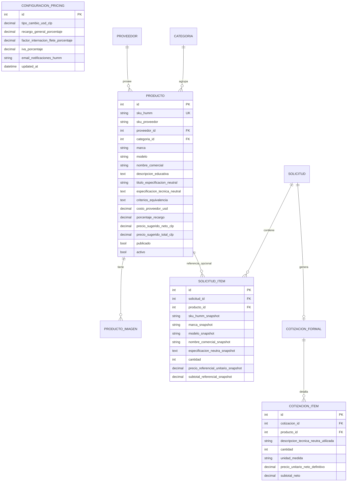
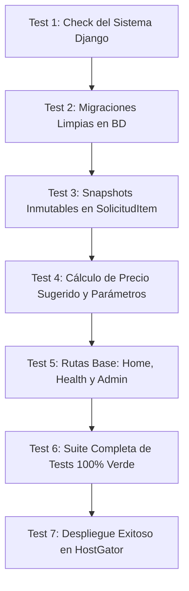

# Plan de Ejecución — Fase 1: Base Funcional e Infraestructura
**Plataforma:** EduCompra Humm (`educompra.humm.cl`)  
**Fecha:** Septiembre 2026  
**Estado:** Propuesta de Ejecución Técnica para Aprobación  
**Versión:** 1.0 — Fase 1

---

## 1. Estructura Inicial del Proyecto

Se adoptará una arquitectura Django limpia, desacoplada y orientada a dominios de negocio, sin librerías innecesarias ni configuraciones redundantes:

```
EDUCOMPRA/
├── .github/
│   └── workflows/
│       └── deploy.yml              # CI/CD automático hacia HostGator vía SSH
├── apps/
│   ├── __init__.py
│   ├── core/                       # Parámetros globales, vistas base y health-check
│   │   ├── __init__.py
│   │   ├── admin.py
│   │   ├── apps.py
│   │   ├── models.py               # Modelo singleton ConfiguracionPricing
│   │   ├── urls.py
│   │   ├── views.py                # Home placeholder y endpoint /health/
│   │   └── tests/
│   │       ├── __init__.py
│   │       └── test_health_and_pricing.py
│   ├── catalogo/                   # Dominio de productos, marcas, categorías y precios
│   │   ├── __init__.py
│   │   ├── admin.py
│   │   ├── apps.py
│   │   ├── models.py               # Proveedor, Categoria, Producto, ProductoImagen
│   │   ├── urls.py
│   │   ├── views.py
│   │   └── tests/
│   │       ├── __init__.py
│   │       └── test_models_catalogo.py
│   └── cotizaciones/               # Dominio de solicitudes, cotizaciones y snapshots
│       ├── __init__.py
│       ├── admin.py
│       ├── apps.py
│       ├── models.py               # SolicitudCotizacion, SolicitudItem, CotizacionFormal, CotizacionItem
│       ├── urls.py
│       ├── views.py
│       └── tests/
│           ├── __init__.py
│           └── test_snapshots_inmutables.py
├── config/                         # Módulo de configuración Django
│   ├── __init__.py
│   ├── asgi.py
│   ├── settings.py                 # Configuración parametrizada por variables de entorno
│   ├── urls.py                     # Enrutador principal del proyecto
│   └── wsgi.py
├── templates/                      # Plantillas SSR HTML5 semánticas
│   ├── base.html                   # Shell principal con cabecera y pie Humm
│   └── core/
│       ├── home.html               # Portada inicial informativa (placeholder limpio)
│       └── health.html
├── static/                         # Archivos estáticos base (sin compiladores complejos)
│   ├── css/
│   │   ├── reset.css               # Normalización CSS ligera
│   │   └── educompra.css           # Estilos modernos Humm (variables, layout responsivo)
│   ├── js/
│   │   └── educompra.js            # Lógica cliente mínima para interactividad
│   └── img/
│       └── icono.svg               # Identidad visual básica
├── media/                          # Almacenamiento local para desarrollo
│   └── catalogo/
│       ├── originales/
│       └── thumbs/
├── .env.example                    # Plantilla documentada de variables de entorno
├── .gitignore                      # Exclusiones estrictas (.env, db.sqlite3, media/, etc.)
├── manage.py
├── passenger_wsgi.py               # Punto de entrada para Phusion Passenger en HostGator
├── requirements.txt                # Dependencias fijadas y verificadas
├── implementation_plan.md          # Plan maestro aprobado de Fase 0
└── implementation_plan_fase_1.md   # Este documento de ejecución
```

---

## 2. Configuración de Producción (HostGator)

Apalancando el entorno operativo ya comprobado en HostGator (cuenta de Humm `/home1/paulocis/` con Apache y Phusion Passenger):

| Componente | Ruta / Configuración en Producción |
| :--- | :--- |
| **Directorio de la Aplicación** | `/home1/paulocis/apps/educompra/app` |
| **Entorno Virtual Python** | `/home1/paulocis/apps/educompra/venv` (creado con Python 3.10+ y gestionado con `uv`) |
| **Document Root Subdominio** | `/home1/paulocis/educompra.humm.cl` |
| **Archivo de Secretos** | `/home1/paulocis/apps/educompra/secrets/.env` (restringido con permisos `0600`) |
| **Archivos Estáticos Recolectados** | `/home1/paulocis/educompra.humm.cl/static/` |
| **Archivos Multimedia** | `/home1/paulocis/educompra.humm.cl/media/` |
| **Reinicio de Proceso WSGI** | `/home1/paulocis/educompra.humm.cl/tmp/restart.txt` |
| **Dominio Autorizado** | `ALLOWED_HOSTS = ['educompra.humm.cl', 'localhost', '127.0.0.1']` |

---

## 3. Modelo Inicial que será Creado

En la Fase 1 se crearán las migraciones iniciales (`0001_initial.py`) dejando la arquitectura de datos relacional establecida, incorporando los ajustes requeridos:



### Reglas Clave Integradas en los Modelos:
1. **Inmutabilidad de Snapshots en `SolicitudItem`:**  
   Al persistir una solicitud, el método `save()` o servicio de creación congelará automáticamente en los campos `*_snapshot` la marca, modelo, nombre comercial, especificación neutra y precio referencial sugerido vigente. Si en el futuro el producto original es modificado o eliminado del catálogo (`on_delete=models.SET_NULL`), el registro histórico de la solicitud permanecerá 100% inalterado.
2. **Neutralidad en `CotizacionItem`:**  
   El campo `descripcion_tecnica_neutra_utilizada` es obligatorio y nunca expone marcas ni SKUs de fabricantes en documentos de salida.
3. **Precio Sugerido en Catálogo vs. Definitivo en Cotización:**  
   `Producto.precio_sugerido_total_clp` es calculado dinámicamente como valor referencial pedagógico. En la cotización formal, `CotizacionItem.precio_unitario_neto_definitivo` permite el ajuste manual del administrador Humm.
4. **Recargo General Administrable:**  
   `ConfiguracionPricing.recargo_general_porcentaje` (valor inicial 80.00%) reside en base de datos como parámetro modificable en cualquier momento desde el panel de administración.

---

## 4. Estrategia de Variables de Entorno

Se empleará la librería `python-dotenv` para mantener las credenciales y configuraciones sensibles completamente segregadas del código fuente:

### Archivo `.env.example` (Versionado en Git):
```ini
# Configuración Django Base
DJANGO_ENV=development
SECRET_KEY=cambiar-por-un-secret-key-robusto-de-al-menos-50-caracteres
DEBUG=True
ALLOWED_HOSTS=localhost,127.0.0.1,educompra.humm.cl

# Configuración de Base de Datos
# Opciones para DB_ENGINE: django.db.backends.sqlite3 | django.db.backends.mysql
DB_ENGINE=django.db.backends.sqlite3
DB_NAME=db.sqlite3
DB_USER=
DB_PASSWORD=
DB_HOST=
DB_PORT=

# Rutas de Producción (HostGator)
STATIC_ROOT=
MEDIA_ROOT=

# Parámetros Iniciales del Sistema
TIPO_CAMBIO_DEFAULT=950.00
RECARGO_GENERAL_DEFAULT=80.00
EMAIL_NOTIFICACIONES_DEFAULT=contacto@humm.cl
```

### Comportamiento en Producción:
*   En el servidor HostGator, el archivo reside en `/home1/paulocis/apps/educompra/secrets/.env` con permisos `0600`.
*   `DEBUG` se establece estrictamente en `False`.
*   `settings.py` valida la presencia de `SECRET_KEY` y emite un error explícito si se detecta una clave por defecto o insegura en modo producción.

---

## 5. Configuración de Base de Datos

Para asegurar máxima portabilidad entre desarrollo local y el entorno compartido de HostGator:

1. **Soporte Dual Transparente:**
   ```python
   # config/settings.py
   if os.getenv("DB_ENGINE") == "django.db.backends.mysql":
       import pymysql
       pymysql.install_as_MySQLdb()  # Compatibilidad 100% pura en Python sin compilar binarios C
       DATABASES = {
           "default": {
               "ENGINE": "django.db.backends.mysql",
               "NAME": os.environ["DB_NAME"],
               "USER": os.environ["DB_USER"],
               "PASSWORD": os.environ["DB_PASSWORD"],
               "HOST": os.getenv("DB_HOST", "localhost"),
               "PORT": os.getenv("DB_PORT", "3306"),
               "OPTIONS": {
                   "charset": "utf8mb4",
                   "init_command": "SET sql_mode='STRICT_TRANS_TABLES'",
               },
           }
       }
   else:
       DATABASES = {
           "default": {
               "ENGINE": "django.db.backends.sqlite3",
               "NAME": BASE_DIR / os.getenv("DB_NAME", "db.sqlite3"),
           }
       }
   ```
2. **Ventaja Crítica en HostGator:** El uso de `pymysql` evita los errores habituales de compilación de `mysqlclient` en servidores compartidos donde no existen privilegios de superusuario para instalar `gcc` o cabeceras de MariaDB.

---

## 6. Autenticación Administrativa

*   **Motor Nativo Django Auth:** Aprovechamiento pleno del sistema de usuarios, permisos y grupos de Django (`User`).
*   **Personalización del Panel `/admin/`:**
    *   Cabecera institucional: `EduCompra Humm — Administración Operativa`.
    *   Título de pestaña: `EduCompra Humm`.
    *   Subtítulo: `Control de Catálogo, Precios y Cotizaciones`.
*   **Comando de Inicialización Idempotente:**
    Se creará un comando de gestión (`python manage.py crear_admin_inicial`) para instanciar el superusuario inicial de forma segura utilizando variables de entorno (`ADMIN_USER`, `ADMIN_EMAIL`, `ADMIN_PASSWORD`), evitando exponer contraseñas en terminales o historial bash.

---

## 7. Despliegue Automatizado con GitHub Actions

El archivo `.github/workflows/deploy.yml` replicará el flujo de trabajo ya validado y en producción de Humm en HostGator:

```yaml
name: Deploy EduCompra to HostGator Production

on:
  push:
    branches:
      - main

jobs:
  deploy:
    name: Despliegue en Servidor HostGator
    runs-on: ubuntu-latest

    steps:
      - name: 1. Checkout Código
        uses: actions/checkout@v4

      - name: 2. Sincronizar Código y Reiniciar en HostGator
        uses: appleboy/ssh-action@v1.2.0
        with:
          host: ${{ secrets.SSH_HOST }}
          username: ${{ secrets.SSH_USER }}
          key: ${{ secrets.SSH_PRIVATE_KEY }}
          port: ${{ secrets.SSH_PORT }}
          script: |
            set -euo pipefail

            APP_DIR="/home1/paulocis/apps/educompra/app"
            VENV_DIR="/home1/paulocis/apps/educompra/venv"
            SUBDOMAIN_DIR="/home1/paulocis/educompra.humm.cl"
            SECRETS_DIR="/home1/paulocis/apps/educompra/secrets"

            cd "$APP_DIR"
            git fetch origin main
            git checkout main
            git merge origin/main --ff-only

            # Instalar dependencias con uv
            /home1/paulocis/.local/bin/uv pip install -r requirements.txt --python "$VENV_DIR" --quiet

            # Cargar variables de entorno
            set -a
            source "${SECRETS_DIR}/.env"
            set +a

            # Ejecutar migraciones
            "${VENV_DIR}/bin/python" manage.py migrate --noinput

            # Recolectar archivos estáticos
            "${VENV_DIR}/bin/python" manage.py collectstatic --noinput

            # Reiniciar Phusion Passenger
            mkdir -p "${SUBDOMAIN_DIR}/tmp"
            touch "${SUBDOMAIN_DIR}/tmp/restart.txt"

      - name: 3. Comprobación de Salud Web (Smoke Test)
        run: |
          HTTP_STATUS=$(curl -s -o /dev/null -w "%{http_code}" https://educompra.humm.cl/health/)
          if [ "$HTTP_STATUS" != "200" ]; then
            echo "❌ Error: https://educompra.humm.cl/health/ devolvió código HTTP $HTTP_STATUS" >&2
            exit 1
          fi
          echo "✔ EduCompra en producción responde correctamente: HTTP $HTTP_STATUS"
```

---

## 8. Configuración Phusion Passenger (`passenger_wsgi.py`)

Para que Apache y Passenger ejecuten la aplicación Django en HostGator:

```python
import os
import sys

# Rutas del entorno en HostGator
app_path = "/home1/paulocis/apps/educompra/app"
venv_path = "/home1/paulocis/apps/educompra/venv"
secrets_file = "/home1/paulocis/apps/educompra/secrets/.env"

if app_path not in sys.path:
    sys.path.insert(0, app_path)

# Cargar variables de entorno de producción si existen
if os.path.exists(secrets_file):
    from dotenv import load_dotenv
    load_dotenv(secrets_file)

os.environ.setdefault("DJANGO_SETTINGS_MODULE", "config.settings")

from django.core.wsgi import get_wsgi_application
application = get_wsgi_application()
```

---

## 9. Medidas Básicas de Seguridad Integradas

1.  **Protección de Formularios y APIs:** CSRF habilitado globalmente (`django.middleware.csrf.CsrfViewMiddleware`).
2.  **Mitigación de Inyección SQL:** Acceso a base de datos realizado exclusivamente a través del ORM de Django con consultas parametrizadas.
3.  **Encabezados HTTP de Seguridad en Producción:**
    *   `X_FRAME_OPTIONS = "DENY"` (Prevención de Clickjacking).
    *   `SECURE_CONTENT_TYPE_NOSNIFF = True` (Prevención de ataques MIME-sniffing).
    *   `SECURE_BROWSER_XSS_FILTER = True` (Filtro XSS del navegador).
4.  **Cookies Seguras:**
    *   `SESSION_COOKIE_SECURE = True` (Solo transmitidas bajo HTTPS en producción).
    *   `CSRF_COOKIE_SECURE = True`.
    *   `SESSION_COOKIE_HTTPONLY = True` (Inaccesibles desde scripts del navegador).
5.  **Aislamiento de Archivos Sensibles:** Archivos `.env`, base de datos y logs excluidos terminantemente del repositorio mediante `.gitignore`.

---

## 10. Criterios de Prueba y Validación de la Fase 1

La entrega de la Fase 1 será considerada completa y aprobada únicamente si cumple al 100% con los siguientes criterios verificables:



1.  **Integridad de Inicio:** `python manage.py check` ejecuta con 0 errores y 0 advertencias.
2.  **Migraciones Exitosas:** `python manage.py migrate` aplica todas las migraciones (`core`, `catalogo`, `cotizaciones`) sin conflictos.
3.  **Garantía de Snapshots Inmutables:**  
    Test unitario automatizado que:
    *   Crea un `Producto` de prueba con datos comerciales y técnicos.
    *   Genera una `SolicitudItem` asociada.
    *   Modifica el producto original (cambio de nombre, precio o marca).
    *   Valida que los campos `*_snapshot` de `SolicitudItem` se mantienen idénticos a los valores del momento de la creación.
4.  **Cálculo Dinámico de Precio Sugerido:**  
    Test unitario que valida que el cambio en `ConfiguracionPricing.recargo_general_porcentaje` (ej: cambiar de 80% a 90%) actualiza el precio referencial sugerido en los productos sin alterar los valores previamente emitidos en cotizaciones formales.
5.  **Verificación de Endpoints Base:**
    *   `GET /`: Responde HTTP 200 con la plantilla de bienvenida y diseño responsivo Humm.
    *   `GET /health/`: Responde HTTP 200 con JSON `{"status": "ok", "app": "educompra", "database": "connected"}`.
    *   `GET /admin/`: Responde HTTP 200 / 302 y renderiza el formulario de inicio de sesión con branding Humm.
6.  **Automatización de Despliegue:** Commit y push a la rama `main` activa el workflow de GitHub Actions, concluyendo con el Smoke Test en `https://educompra.humm.cl/health/` con código HTTP 200.

---

*Fin del Plan de Ejecución Fase 1 — EduCompra Humm*
