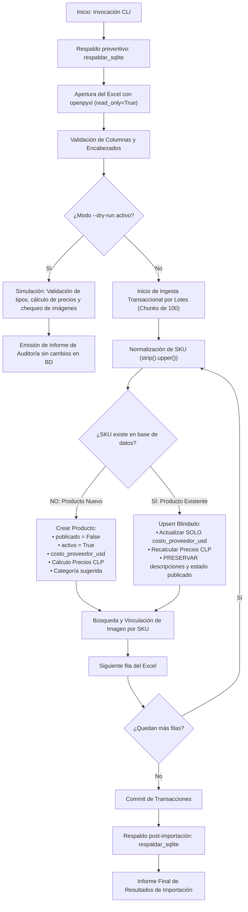

# PLAN DE EJECUCIÓN FASE 2 — CATÁLOGO MAESTRO E IMÁGENES
## Plataforma EduCompra Humm (`educompra.humm.cl`)

**Estado:** Propuesta Técnica para Aprobación  
**Fase Previa:** [Fase 1 — Base Funcional e Infraestructura](file:///Users/rmerinog/PLATAFORMAS/EDUCOMPRA/INFORME_IMPLEMENTACION_FASE_1.md) (Cerrada y Verificada en Producción)  
**Motor de Base de Datos:** Django 5.2 LTS + SQLite (Modo WAL, fuera de document root, respaldos atómicos)  
**Objetivo de Fase 2:** Construcción del catálogo maestro interno de abastecimiento (~945 SKUs Keyestudio), motor de importación segura, vinculación automática de imágenes por SKU y cálculo dinámico de precios sugeridos en CLP.

---

## 1. Alcance y Límites Estrictos de la Fase 2

Conforme a las directrices de arquitectura y planificación del proyecto:

### Lo que SÍ cubre la Fase 2:
1. **Ingesta y Validación de Datos Reales:** Lectura, análisis estructural y validación del archivo Excel maestro de Keyestudio.
2. **Banco de Imágenes:** Organización, almacenamiento y vinculación automática de imágenes nombradas por SKU del fabricante.
3. **Comando de Importación Segura (CLI):** Creación del comando `importar_catalogo_keyestudio` con modo simulado (`--dry-run`), manejo de transacciones atómicas y reporte detallado de auditoría.
4. **Detección y Gestión de Duplicados:** Detección de colisiones de SKU y reglas de unicidad.
5. **Cálculo Automático de Precios en CLP:** Aplicación de la fórmula institucional de pricing (`Costo USD * T.C. * Factor Internación * Margen * IVA`).
6. **Despublicación por Defecto:** Todos los productos ingresan estrictamente con `publicado = False` y `activo = True`.
7. **Actualizaciones No Destructivas (Upsert Blindado):** Lógica que permite re-importar futuros catálogos actualizando costos sin destruir enriquecimientos pedagógicos.
8. **Respaldo Automático:** Ejecución de snapshot en caliente (`respaldar_sqlite`) antes y después del proceso de importación.

### Lo que NO cubre la Fase 2 (Postergado para fases posteriores):
* ⛔ **NO realizar todavía la curaduría pedagógica** de los 50–100 productos públicos (corresponde a la **Fase 3**).
* ⛔ **NO desarrollar el cotizador público**, drawer interactivo ni formulario de solicitudes (corresponde a la **Fase 4**).
* ⛔ **NO publicar productos en el frontend** (`publicado = False` para todo el catálogo inicial).
* ⛔ **NO generar documentos PDF/Excel para cotizaciones** (corresponde a la **Fase 5**).

---

## 2. Diagnóstico de Datos de Entrada

### 2.1 Archivo Excel Maestro (Keyestudio)
* **Volumen Estimado:** ~966 filas brutas (~945 SKUs únicos de abastecimiento).
* **Campos Críticos Esperados en el Excel:**
  1. `SKU / Item No.` (ej: `KS0011`, `KS0456`): Clave de enlace única del fabricante.
  2. `Product Name / Description`: Denominación en inglés del fabricante.
  3. `Category / Subcategory`: Categoría asignada en fábrica (utilizada como sugerencia inicial de clasificación).
  4. `Unit Price (USD)`: Costo de adquisición mayorista en dólares estadounidenses.
  5. `Package / Unit`: Presentación (unidad, set, pack).
* **Casuísticas a Controlar Durante la Lectura:**
  * Celdas con fórmulas o texto formateado como moneda (`$ 12.50`, espacios, comas en lugar de puntos).
  * Filas de cabecera múltiples o notas al pie del proveedor.
  * Filas en blanco o productos discontinuados sin precio.
  * SKUs repetidos con ligeras variaciones de empaque o versión.

### 2.2 Banco de Imágenes
* **Nomenclatura Estándar:** `<SKU_PROVEEDOR>.<ext>` (ej: `KS0011.jpg`, `KS0011.png`, `KS0011.webp`).
* **Directorio de Destino en Producción:**  
  `/home1/paulocis/educompra.humm.cl/media/productos/`
* **Reglas de Procesamiento de Imágenes con Pillow:**
  * Conversión automática a formatos web optimizados o compresión ligera para minimizar el peso de carga en el admin.
  * Generación automática de miniaturas (*thumbnails*) para el listado del panel de administración Django.
  * Si un SKU del Excel no cuenta con imagen física en el banco, el producto se creará normalmente, marcándose internamente para recibir el placeholder estilizado de EduCompra.

---

## 3. Arquitectura del Motor de Importación

Para garantizar robustez y evitar los límites de tiempo de ejecución HTTP en servidores compartidos (Apache/Passenger suele cortar peticiones web tras 30–60 segundos), el importador se desarrollará como un **comando de gestión CLI** de Django:

```bash
python manage.py importar_catalogo_keyestudio \
    --excel=/ruta/al/catalogo_keyestudio.xlsx \
    --imagenes=/ruta/al/directorio_imagenes/ \
    [--dry-run] \
    [--actualizar-costos]
```

### 3.1 Flujo del Proceso de Ingesta



---

## 4. Reglas de Negocio del Upsert Blindado

El catálogo se importará garantizando **cero pérdida de datos** ante futuras re-importaciones del Excel del proveedor:

| Atributo en Base de Datos | En Producto Nuevo | En Re-importación / Actualización Futura |
| :--- | :--- | :--- |
| `sku_proveedor` | Se registra exactamente desde el Excel | Se usa como identificador único de búsqueda (clave inmutable) |
| `sku_humm` | Generado automáticamente (`HUMM-KEY-<SKU>`) | Intacto (preserva la referencia interna de Humm) |
| `proveedor` | Asignado a Proveedor "Keyestudio" | Intacto |
| `categoria` | Asignada según columna del Excel o "Sin clasificar" | **PROTEGIDO:** No se sobrescribe si Humm ya reclasificó el producto |
| `nombre_original_proveedor`| Nombre original en inglés del Excel | Actualizado con el texto más reciente del fabricante |
| `nombre_comercial` | Inicializado con el nombre del proveedor | **PROTEGIDO:** Jamás se sobrescribe si fue editado en español por Humm |
| `descripcion_educativa` | Vacía (preparada para Fase 3) | **PROTEGIDO:** Jamás se sobrescribe |
| `titulo_especificacion_neutral` | Plantilla neutra base sugerida | **PROTEGIDO:** Jamás se sobrescribe |
| `especificacion_tecnica_neutral` | Plantilla neutra base sugerida | **PROTEGIDO:** Jamás se sobrescribe |
| `costo_proveedor_usd` | Costo extraído del Excel | **ACTUALIZADO:** Se reemplaza con el nuevo costo vigente |
| `precio_sugerido_total_clp` | Calculado dinámicamente con fórmula de pricing | **RECALCULADO:** Se actualiza al nuevo precio según el nuevo costo |
| `publicado` | **`False`** (Estrictamente despublicado) | **PROTEGIDO:** No altera el estado de publicación establecido |
| `imagenes` (`ProductoImagen`)| Vinculadas si existen en el banco | Si no tenía imagen y ahora existe, se vincula automáticamente |

---

## 5. Algoritmo de Cálculo Dinámico de Precios

Cada producto importado ejecutará en su método `save()` o mediante el servicio de pricing la fórmula oficial aprobada:

$$
\text{Costo Puesto Chile (CLP)} = \text{costo\_proveedor\_usd} \times \text{tipo\_cambio} \times \left(1 + \frac{\text{factor\_internacion}}{100}\right)
$$

$$
\text{Precio Sugerido Neto (CLP)} = \text{Costo Puesto Chile (CLP)} \times \left(1 + \frac{\text{recargo\_general}}{100}\right)
$$

$$
\text{Precio Sugerido Total con IVA (CLP)} = \text{Precio Sugerido Neto (CLP)} \times \left(1 + \frac{\text{iva}}{100}\right)
$$

* Todos los cálculos toman los valores activos del singleton `ConfiguracionPricing`.
* Los precios finales en CLP se redondean al entero más cercano (`ROUND_HALF_UP`) para presentación comercial limpia en pesos chilenos sin decimales.

---

## 6. Plan de Trabajo Detallado (Paso a Paso)

### Tarea 2.1 — Preparación de Infraestructura y Modelos de Imágenes
* Verificar los modelos `ProductoImagen` y sus directivas de subida en `apps.catalogo`.
* Configurar almacenamiento en `MEDIA_ROOT` (`/home1/paulocis/educompra.humm.cl/media/productos/`).
* Configurar servicio de miniaturas (*thumbnails*) mediante Pillow.

### Tarea 2.2 — Desarrollo del Comando `importar_catalogo_keyestudio`
* Crear archivo `apps/catalogo/management/commands/importar_catalogo_keyestudio.py`.
* Implementar parser de Excel con `openpyxl` optimizado en modo lectura (`read_only=True`).
* Añadir flags de ejecución:
  * `--excel`: Ruta al archivo Excel maestro.
  * `--imagenes`: Ruta a la carpeta de imágenes por SKU.
  * `--dry-run`: Modo simulación sin persistencia en base de datos.
  * `--limite`: Parámetro opcional para pruebas de lotes reducidos (ej: `--limite=10`).
* Incorporar manejo de transacciones con `transaction.atomic()` en bloques controlados.

### Tarea 2.3 — Algoritmo de Vinculación de Imágenes por SKU
* Normalización de nombres de archivo: eliminación de extensiones, conversión a mayúsculas.
* Soporte para sufijos de variantes (ej: `KS0011_01.jpg`, `KS0011_02.jpg`).
* Detección de imagen principal y asignación de `es_portada = True`.
* Flag en producto `tiene_imagen` para filtrado rápido en el administrador.

### Tarea 2.4 — Suite de Pruebas Automatizadas del Importador
* Desarrollar pruebas unitarias en `apps/catalogo/tests/test_importador.py`:
  1. Prueba de importación exitosa de un archivo Excel de prueba en memoria.
  2. Prueba del cálculo correcto de precios según fórmula de pricing.
  3. Prueba de no-sobrescritura (upsert blindado): confirmar que un producto ya enriquecido conserva sus descripciones y estado publicado al re-importar.
  4. Prueba de vinculación de imágenes con archivos simulados en `SimpleUploadedFile`.
  5. Prueba del flag `--dry-run` asegurando que no se creen registros.

### Tarea 2.5 — Ejecución de Importación Real en Producción
1. Recepción y disposición del archivo Excel y banco de imágenes en el servidor HostGator.
2. Ejecución previa de respaldo atómico: `python manage.py respaldar_sqlite`.
3. Ejecución en modo simulación: `python manage.py importar_catalogo_keyestudio --excel=... --dry-run`.
4. Revisión del reporte de simulación (filas leídas, SKUs detectados, inconsistencias detectadas).
5. Ejecución definitiva de importación masiva.
6. Ejecución posterior de respaldo atómico: `python manage.py respaldar_sqlite`.

### Tarea 2.6 — Verificación en Django Admin y Control de Calidad
* Acceder a `https://educompra.humm.cl/admin/catalogo/producto/`.
* Verificar:
  * Total de productos creados (~945 SKUs).
  * Estado `publicado = False` en el 100% de los ítems.
  * Costos USD y precios CLP coherentes y redondeados.
  * Imágenes desplegadas correctamente en el listado y detalle del admin.
  * Filtros por categoría, estado de stock y presencia de imagen operativos.

### Tarea 2.7 — Informe de Cierre de Fase 2
* Elaboración de `INFORME_IMPLEMENTACION_FASE_2.md` con:
  * Métricas reales de importación (total procesado, creados, duplicados detectados, imágenes vinculadas).
  * Estadísticas de precios calculados (rango mínimo, máximo, promedio).
  * Confirmación de despublicación total previa a curaduría.
  * Resultados de la suite de pruebas.

---

## 7. Criterios de Aceptación para Dar por Concluida la Fase 2

1. **Ingesta Completa:** La totalidad del catálogo Keyestudio incorporada en SQLite sin caídas de proceso.
2. **Despublicación Estricta:** Ningún producto visible en la web pública (`publicado = False`).
3. **Cálculo de Precios Válido:** Precios referenciales en CLP calculados para cada ítem conforme a la fórmula paramétrica.
4. **Imágenes Asociadas:** Imágenes por SKU vinculadas automáticamente y visualizables en el administrador.
5. **Idempotencia Comprobada:** Una segunda ejecución del importador no duplica registros ni modifica textos pedagógicos.
6. **Integridad y Respaldo:** Copia de seguridad SQLite (`.sqlite3`) generada y almacenada con permisos `0600`.
7. **Pipeline CI/CD:** Todo el código integrado y desplegado en GitHub Actions sin errores.

---

*Plan preparado para revisión y aprobación previa a la ejecución de la importación.*
