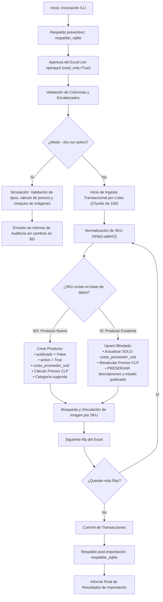

# PLAN DE EJECUCIÓN FASE 2 — CATÁLOGO MAESTRO E IMÁGENES
## Plataforma EduCompra Humm (`educompra.humm.cl`)

**Estado:** Propuesta Técnica para Aprobación  
**Fase Previa:** [Fase 1 — Base Funcional e Infraestructura](file:///Users/rmerinog/PLATAFORMAS/EDUCOMPRA/INFORME_IMPLEMENTACION_FASE_1.md) (Cerrada y Verificada en Producción)  
**Motor de Base de Datos:** Django 5.2 LTS + SQLite (Modo WAL, fuera de document root, respaldos atómicos)  
**Objetivo de Fase 2:** Construcción del catálogo maestro interno de abastecimiento (~945 SKUs Keyestudio), motor de importación segura, vinculación automática de imágenes por SKU y cálculo dinámico de precios sugeridos en CLP.

---

## 1. Alcance y Límites Estrictos de la Fase 2

Conforme a las directrices de arquitectura y planificación del proyecto:

### Lo que SÍ cubre la Fase 2:
1. **Ingesta y Validación de Datos Reales:** Lectura, análisis estructural y validación del archivo Excel maestro de Keyestudio.
2. **Banco de Imágenes:** Organización, almacenamiento y vinculación automática de imágenes nombradas por SKU del fabricante.
3. **Comando de Importación Segura (CLI):** Creación del comando `importar_catalogo_keyestudio` con modo simulado (`--dry-run`), manejo de transacciones atómicas y reporte detallado de auditoría.
4. **Detección y Gestión de Duplicados:** Detección de colisiones de SKU y reglas de unicidad.
5. **Cálculo Automático de Precios en CLP:** Aplicación de la fórmula institucional de pricing (`Costo USD * T.C. * Factor Internación * Margen * IVA`).
6. **Despublicación por Defecto:** Todos los productos ingresan estrictamente con `publicado = False` y `activo = True`.
7. **Actualizaciones No Destructivas (Upsert Blindado):** Lógica que permite re-importar futuros catálogos actualizando costos sin destruir enriquecimientos pedagógicos.
8. **Respaldo Automático:** Ejecución de snapshot en caliente (`respaldar_sqlite`) antes y después del proceso de importación.

### Lo que NO cubre la Fase 2 (Postergado para fases posteriores):
* ⛔ **NO realizar todavía la curaduría pedagógica** de los 50–100 productos públicos (corresponde a la **Fase 3**).
* ⛔ **NO desarrollar el cotizador público**, drawer interactivo ni formulario de solicitudes (corresponde a la **Fase 4**).
* ⛔ **NO publicar productos en el frontend** (`publicado = False` para todo el catálogo inicial).
* ⛔ **NO generar documentos PDF/Excel para cotizaciones** (corresponde a la **Fase 5**).

---

## 2. Diagnóstico y Estructura Real de Datos de Entrada

### 2.1 Archivo Excel Maestro (Keyestudio) — Estructura Real
El archivo maestro Keyestudio disponible actualmente contiene **exactamente** las siguientes 5 columnas:
1. `SKU o ID` (Clave de enlace del fabricante, ej: `KS0011`).
2. `Descripción del producto` (Texto original en inglés del fabricante).
3. `Miniatura` (Enlace o referencia a miniatura web; puede venir vacía y no es obligatoria).
4. `Precio (USD)` (Texto con formato como `11.99 USD`, debe normalizarse a `Decimal`).
5. `Imagen alta resolución` (Referencia a imagen de alta resolución).

> [!IMPORTANT]
> **Ajuste de Estructura:** No asumir columnas como `Category`, `Subcategory`, `Package / Unit` ni clasificaciones adicionales. La importación opera exclusivamente contra estos 5 encabezados reales.

* **Volumen Real Estimado:**
  * Aproximadamente **966 filas de productos**.
  * Aproximadamente **944 SKUs únicos**.
  * El importador **no codificará estas cifras como constantes**, sino que las calculará dinámicamente en cada ejecución.
* **Normalización de Precios:**
  * La columna `Precio (USD)` contiene texto (ej: `11.99 USD`, `$11.99`, ` 11,99 USD `).
  * Se implementará un parser robusto con expresiones regulares para extraer la cifra numérica, convertir comas a puntos y retornar un `Decimal(2)` válido o marcar error si no puede interpretarse.
* **Categorización Inicial:**
  * Dado que el Excel no contiene categorías, **todos los productos nuevos ingresarán inicialmente bajo la categoría: "Sin clasificar"**.
  * No se realizará categorización automática definitiva en Fase 2; la curaduría y clasificación temática se ejecutará en Fase 3.

### 2.2 Banco de Imágenes y Derivados Optimizados
* **Nomenclatura Estándar:** Coincidencia directa `SKU → nombre de archivo`.
* **Formatos Soportados:** `.jpg`, `.jpeg`, `.png`, `.webp`.
* **Variantes Soportadas:** `SKU.ext`, `SKU_01.ext`, `SKU_02.ext`, `SKU_1.ext`, `SKU-1.ext`.
* **Imagen de Portada:** La primera imagen válida encontrada se asignará automáticamente como portada (`es_portada = True`).
* **Preservación de Fuentes:** No se modificarán ni destruirán los archivos fuente originales.
* **Derivados con Pillow:** Se generarán miniaturas y versiones web optimizadas para el catálogo y el panel de administración.
* **Directorio en Producción:** `/home1/paulocis/educompra.humm.cl/media/productos/`.

---

## 3. Manejo Obligatorio de Duplicados en Dry-Run

El comando de simulación clasificará obligatoriamente los registros con SKU repetidos en:

1. **Duplicado Idéntico:**
   * Mismo SKU, misma descripción y mismo precio.
   * Se consolida en un único registro para importación, reportando la duplicidad en el informe.
2. **Duplicado Conflictivo:**
   * Mismo SKU pero diferente descripción, precio u otra información relevante.
   * **Regla estricta:** NO elegir automáticamente.
   * Se marca con estado: **`CONFLICTO — REQUIERE REVISIÓN`** y **se excluye de la importación definitiva** hasta su resolución manual por Humm.
   * El informe mostrará en detalle cada fila en conflicto, los valores dispares y las líneas del Excel afectadas.

---

## 4. Fórmula Paramétrica de Pricing

Se utilizará consistentemente el término **RECARGO COMERCIAL** (evitando "margen" para no confundir markup con margen bruto):

$$
\text{Costo Puesto Chile (CLP)} = \text{costo\_proveedor\_usd} \times \text{tipo\_cambio} \times \left(1 + \frac{\text{factor\_internacion}}{100}\right)
$$

$$
\text{Precio Sugerido Neto (CLP)} = \text{Costo Puesto Chile (CLP)} \times \left(1 + \frac{\text{recargo\_comercial}}{100}\right)
$$

$$
\text{Precio Sugerido Total con IVA (CLP)} = \text{Precio Sugerido Neto (CLP)} \times \left(1 + \frac{\text{iva}}{100}\right)
$$

* Todos los parámetros se extraen del singleton administrable `ConfiguracionPricing` (recargo comercial base de 80.00%, tipo de cambio, internación 15.00%, IVA 19.00%).

---

## 5. Respaldo Consistente de SQLite

El comando `respaldar_sqlite` implementa la *SQLite Online Backup API* (`sqlite3.Connection.backup()`), garantizando:
* Respaldo atómico y consistente sin detener la aplicación ni ignorar el estado de los archivos WAL (`-wal` / `-shm`).
* Verificación posterior inmediata de integridad (`PRAGMA integrity_check;`).
* Ubicación fuera del document root (`/home1/paulocis/apps/educompra/backups/`) con permisos restrictivos `0700` (directorio) y `0600` (archivo).

Para garantizar robustez y evitar los límites de tiempo de ejecución HTTP en servidores compartidos (Apache/Passenger suele cortar peticiones web tras 30–60 segundos), el importador se desarrollará como un **comando de gestión CLI** de Django:

```bash
python manage.py importar_catalogo_keyestudio \
    --excel=/ruta/al/catalogo_keyestudio.xlsx \
    --imagenes=/ruta/al/directorio_imagenes/ \
    [--dry-run] \
    [--actualizar-costos]
```

### 3.1 Flujo del Proceso de Ingesta



---

## 4. Reglas de Negocio del Upsert Blindado

El catálogo se importará garantizando **cero pérdida de datos** ante futuras re-importaciones del Excel del proveedor:

| Atributo en Base de Datos | En Producto Nuevo | En Re-importación / Actualización Futura |
| :--- | :--- | :--- |
| `sku_proveedor` | Se registra exactamente desde el Excel | Se usa como identificador único de búsqueda (clave inmutable) |
| `sku_humm` | Generado automáticamente (`HUMM-KEY-<SKU>`) | Intacto (preserva la referencia interna de Humm) |
| `proveedor` | Asignado a Proveedor "Keyestudio" | Intacto |
| `categoria` | Asignada según columna del Excel o "Sin clasificar" | **PROTEGIDO:** No se sobrescribe si Humm ya reclasificó el producto |
| `nombre_original_proveedor`| Nombre original en inglés del Excel | Actualizado con el texto más reciente del fabricante |
| `nombre_comercial` | Inicializado con el nombre del proveedor | **PROTEGIDO:** Jamás se sobrescribe si fue editado en español por Humm |
| `descripcion_educativa` | Vacía (preparada para Fase 3) | **PROTEGIDO:** Jamás se sobrescribe |
| `titulo_especificacion_neutral` | Plantilla neutra base sugerida | **PROTEGIDO:** Jamás se sobrescribe |
| `especificacion_tecnica_neutral` | Plantilla neutra base sugerida | **PROTEGIDO:** Jamás se sobrescribe |
| `costo_proveedor_usd` | Costo extraído del Excel | **ACTUALIZADO:** Se reemplaza con el nuevo costo vigente |
| `precio_sugerido_total_clp` | Calculado dinámicamente con fórmula de pricing | **RECALCULADO:** Se actualiza al nuevo precio según el nuevo costo |
| `publicado` | **`False`** (Estrictamente despublicado) | **PROTEGIDO:** No altera el estado de publicación establecido |
| `imagenes` (`ProductoImagen`)| Vinculadas si existen en el banco | Si no tenía imagen y ahora existe, se vincula automáticamente |

---

## 5. Algoritmo de Cálculo Dinámico de Precios

Cada producto importado ejecutará en su método `save()` o mediante el servicio de pricing la fórmula oficial aprobada:

$$
\text{Costo Puesto Chile (CLP)} = \text{costo\_proveedor\_usd} \times \text{tipo\_cambio} \times \left(1 + \frac{\text{factor\_internacion}}{100}\right)
$$

$$
\text{Precio Sugerido Neto (CLP)} = \text{Costo Puesto Chile (CLP)} \times \left(1 + \frac{\text{recargo\_comercial}}{100}\right)
$$

$$
\text{Precio Sugerido Total con IVA (CLP)} = \text{Precio Sugerido Neto (CLP)} \times \left(1 + \frac{\text{iva}}{100}\right)
$$

* Todos los cálculos toman los valores activos del singleton `ConfiguracionPricing`.
* Los precios finales en CLP se redondean al entero más cercano (`ROUND_HALF_UP`) para presentación comercial limpia en pesos chilenos sin decimales.

---

## 6. Plan de Trabajo Detallado (Paso a Paso)

### Tarea 2.1 — Modelos y Almacenamiento de Imágenes
* Verificar los modelos `ProductoImagen` y sus directivas de almacenamiento en `apps.catalogo`.
* Configurar almacenamiento en `MEDIA_ROOT` (`/home1/paulocis/educompra.humm.cl/media/productos/`).
* Configurar generación de miniaturas y optimización con Pillow para admin/catálogo.

### Tarea 2.2 — Desarrollo del Comando `importar_catalogo_keyestudio`
* Crear archivo `apps/catalogo/management/commands/importar_catalogo_keyestudio.py`.
* Implementar parser con `openpyxl` en modo lectura (`read_only=True`).
* Implementar normalización de encabezados y parsing numérico seguro para `Precio (USD)` (`11.99 USD` -> `Decimal`).
* Implementar lógica de clasificación de duplicados:
  * **Duplicados idénticos:** Consolidación automática y registro de auditoría.
  * **Duplicados conflictivos:** Marcado como `CONFLICTO — REQUIERE REVISIÓN` y exclusión preventiva de importación.
* Añadir flags de ejecución:
  * `--excel`: Ruta al archivo Excel maestro Keyestudio.
  * `--imagenes`: Ruta al directorio de imágenes por SKU.
  * `--dry-run`: Simulación completa obligatoria sin persistencia en base de datos.
  * `--limite`: Parámetro opcional para pruebas de lotes reducidos.

### Tarea 2.3 — Algoritmo de Vinculación de Imágenes por SKU
* Normalización: eliminación de extensiones, conversión a mayúsculas (`strip().upper()`).
* Soporte para variantes: `SKU.ext`, `SKU_01.ext`, `SKU_02.ext`, `SKU_1.ext`, `SKU-1.ext`.
* Asignación automática de portada a la primera imagen válida encontrada (`es_portada = True`).
* Flag en producto `tiene_imagen` para filtrado rápido en el administrador.

### Tarea 2.4 — Suite de Pruebas Automatizadas del Importador
* Desarrollar pruebas unitarias en `apps/catalogo/tests/test_importador.py`:
  1. Prueba de parsing de precios (`11.99 USD`, `$11.99`, espacios, comas).
  2. Prueba de clasificación de duplicados (idénticos vs conflictivos).
  3. Prueba del cálculo correcto de precios según fórmula de recargo comercial.
  4. Prueba de no-sobrescritura (upsert blindado): confirmar que un producto ya enriquecido conserva sus descripciones y estado publicado al re-importar.
  5. Prueba de vinculación de imágenes y flags de cobertura.
  6. Prueba estricta del flag `--dry-run` asegurando que no se creen registros.

### Tarea 2.5 — PUNTO DE CONTROL OBLIGATORIO: Ejecución de Dry-Run Real
1. Recepción y disposición del archivo Excel y banco de imágenes en el entorno de trabajo.
2. Ejecución exclusiva en modo simulación:
   ```bash
   python manage.py importar_catalogo_keyestudio \
       --excel=... \
       --imagenes=... \
       --dry-run
   ```
3. Generación del documento formal:
   # `REPORTE_DRY_RUN_CATALOGO_FASE_2.md`
   con las métricas reales exigidas:
   * Filas totales leídas
   * Filas válidas
   * SKU únicos
   * SKU duplicados (idénticos vs conflictivos detallados)
   * Filas sin SKU / sin precio / precios no interpretables
   * Rango de precios USD (mínimo, máximo, promedio)
   * Imágenes encontradas, productos sin imagen, imágenes huérfanas
   * Conteo de productos que se crearían, actualizarían o ignorarían
4. **DETENCIÓN OBLIGATORIA:** Enviar el reporte a Humm para revisión y autorización antes de cualquier escritura en la base de datos de producción.

### Tarea 2.6 — Ejecución de Importación Definitiva (Solo tras Aprobación de Dry-Run)
* Respaldo previo consistente: `python manage.py respaldar_sqlite`.
* Ejecución de importación real sin `--dry-run`.
* Respaldo posterior consistente: `python manage.py respaldar_sqlite`.
* Verificación en Django Admin (`https://educompra.humm.cl/admin/catalogo/producto/`):
  * 100% de productos en estado `publicado = False`.
  * Precios en CLP coherentes y redondeados.
  * Imágenes vinculadas desplegadas en admin.
* Elaboración y entrega de `INFORME_IMPLEMENTACION_FASE_2.md`.

---

## 7. Criterios de Aceptación de la Fase 2

1. **Ingesta Completa y Segura:** Catálogo Keyestudio incorporado en SQLite sin errores ni bloqueos.
2. **Despublicación Estricta:** Ningún producto visible en la web pública (`publicado = False`).
3. **Cálculo de Precios Válido:** Precios referenciales en CLP calculados para cada ítem conforme a la fórmula de recargo comercial.
4. **Imágenes Asociadas:** Imágenes por SKU vinculadas automáticamente y visualizables en el administrador.
5. **Idempotencia Comprobada:** Una segunda ejecución del importador no duplica registros ni modifica textos pedagógicos.
6. **Integridad y Respaldo:** Copia de seguridad SQLite generada con SQLite Online Backup API y verificada con `PRAGMA integrity_check`.
7. **Control de Calidad Superado:** Dry-run auditado y aprobado previamente por Humm mediante `REPORTE_DRY_RUN_CATALOGO_FASE_2.md`.

---

*Plan actualizado con las observaciones de Humm. Listo para proceder con la implementación técnica del importador.*

