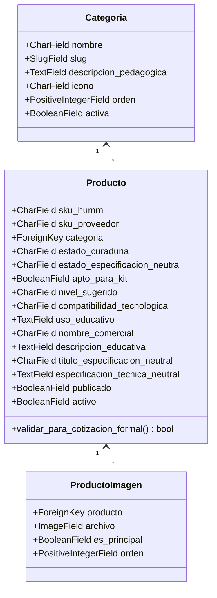
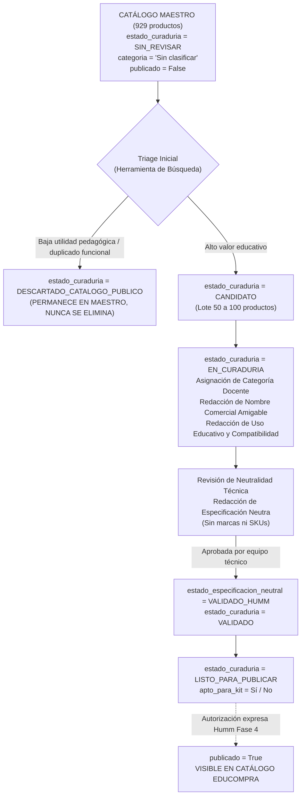

# PLAN DE IMPLEMENTACIÓN — FASE 3
## Curaduría Educativa, Categorización y Selección del Catálogo Público
### Plataforma EduCompra Humm (`educompra.humm.cl`)

**Documento:** `implementation_plan_fase_3.md`  
**Fecha de Elaboración:** 28 de Septiembre de 2026  
**Responsable Técnico:** Antigravity (Google DeepMind Pair Programmer)  
**Destinatario:** Equipo Directivo y Pedagógico de Humm  
**Estado:** **PROPUESTA PARA REVISIÓN Y APROBACIÓN PREVIA**

---

## 1. Contexto, Objetivos y Principios Rectores

### 1.1 Estado Inicial al Cierre de Fase 2
La Fase 2 dejó consolidado el catálogo maestro con:
* **929 productos físicos ingresados** en SQLite (producción y local).
* **928 productos con fotografía vinculada** (1.002 registros fotográficos derivados).
* **1 producto con placeholder institucional** (`KS0006`).
* **15 SKUs conflictivos aislados** en [`CONFLICTOS_CATALOGO_KEYESTUDIO.md`](file:///Users/rmerinog/PLATAFORMAS/EDUCOMPRA/CONFLICTOS_CATALOGO_KEYESTUDIO.md).
* **0 productos publicados** (`publicado = False` en el 100% de la base).
* **Categoría única provisional:** `"Sin clasificar"`.
* **Respaldos y base de datos con integridad verificada** en HostGator.

### 1.2 Corrección Conceptual Obligatoria (Alineamiento Humm)
Los campos `titulo_especificacion_neutral` y `especificacion_tecnica_neutral` generados durante la importación inicial corresponden estrictamente a **BORRADORES AUTOMÁTICOS NO VALIDADOS**.
> [!IMPORTANT]
> Ningún producto podrá ser utilizado para emitir cotizaciones formales ni documentación de compra pública si su especificación técnica neutra no ha sido validada expresamente por el equipo de Humm (`estado_especificacion_neutral == 'VALIDADO_HUMM'`).

### 1.3 Objetivo de la Fase 3
Transformar el catálogo técnico maestro de 929 productos en un **Catálogo Educativo Humm** simple, comprensible y pedagógicamente relevante para profesores, seleccionando y curando un lote inicial de **50 a 100 productos de alta demanda educativa**, sin activar aún la publicación masiva ni el cotizador público (Fase 4).

### 1.4 Los 10 Principios de Curaduría Pedagógica
1. **Utilidad educativa clara:** Responde a objetivos de aprendizaje en ciencia, tecnología, ingeniería o matemáticas.
2. **Proyectos de aula viables:** Permite construir prototipos reales con estudiantes en el tiempo de una clase o taller.
3. **Facilidad de uso:** Documentación accesible, librerías estándar y bajo riesgo de frustración técnica inicial.
4. **Relación costo/beneficio:** Costo accesible para establecimientos con presupuestos escolares regulares.
5. **Compatibilidad estándar:** Funciona con plataformas masivas (Arduino UNO/Nano, ESP32, micro:bit, Raspberry Pi).
6. **Combinabilidad:** Se articula de forma natural con otros módulos del catálogo (ej: sensor + pantalla + relé).
7. **Fotografía de calidad:** Posee fotografía clara para que el docente identifique qué está cotizando.
8. **Comprensibilidad docente:** Explicable en términos sencillos, evitando tecnicismos innecesarios de fábrica.
9. **Potencial de volumen:** Producto susceptible de ser comprado por cursos completos (15 a 30 unidades).
10. **Aptitud para kits:** Sirve como bloque constructivo para armar kits temáticos en fases posteriores.

---

## 2. Cambios al Modelo de Datos (`apps/catalogo/models.py`)

Se realizarán ampliaciones mínimas, no destructivas y 100% compatibles hacia atrás sobre el modelo [`Producto`](file:///Users/rmerinog/PLATAFORMAS/EDUCOMPRA/apps/catalogo/models.py):



### 2.1 Nuevos Campos Específicos

```python
# 1. Estados de Curaduría y Flujo de Calidad
ESTADOS_CURADURIA = [
    ("SIN_REVISAR", "Sin revisar"),
    ("CANDIDATO", "Candidato a catálogo público"),
    ("DESCARTADO_CATALOGO_PUBLICO", "Descartado para catálogo público (conservar en maestro)"),
    ("EN_CURADURIA", "En proceso de curaduría"),
    ("VALIDADO", "Curaduría pedagógica validada"),
    ("LISTO_PARA_PUBLICAR", "Listo para publicar"),
]

ESTADOS_ESPECIFICACION_NEUTRAL = [
    ("NO_REVISADO", "No revisado (Borrador automático)"),
    ("BORRADOR", "En redacción técnica"),
    ("VALIDADO_HUMM", "Validado técnicamente por Humm (Apto compra pública)"),
]

NIVELES_SUGERIDOS = [
    ("NO_DEFINIDO", "No definido"),
    ("INICIAL", "Inicial / Primaria (Básica)"),
    ("INTERMEDIO", "Intermedio / Secundaria (Media)"),
    ("AVANZADO", "Avanzado / Técnico-Profesional"),
]
```

### 2.2 Atributos Agregados a `Producto`:
* `estado_curaduria`: `CharField(max_length=35, choices=ESTADOS_CURADURIA, default="SIN_REVISAR", db_index=True)`
* `estado_especificacion_neutral`: `CharField(max_length=20, choices=ESTADOS_ESPECIFICACION_NEUTRAL, default="NO_REVISADO", db_index=True)`
* `apto_para_kit`: `BooleanField(default=False, verbose_name="Apto para Kits Educativos")`
* `nivel_sugerido`: `CharField(max_length=20, choices=NIVELES_SUGERIDOS, default="NO_DEFINIDO")`
* `compatibilidad_tecnologica`: `CharField(max_length=150, blank=True, verbose_name="Compatibilidad", help_text="Ej: Arduino UNO, ESP32, micro:bit, Raspberry Pi")`
* `uso_educativo`: `TextField(blank=True, verbose_name="Uso Educativo y Proyectos de Aula", help_text="¿Qué pueden construir o aprender los estudiantes con este producto?")`

### 2.3 Regla de Blindaje en Método de Modelo
```python
def puede_generar_cotizacion_formal(self):
    """
    Regla obligatoria de Humm: Un producto solo puede emitir cotización formal
    institucional si su especificación técnica neutra ha sido validada.
    """
    return self.estado_especificacion_neutral == "VALIDADO_HUMM"
```

---

## 3. Taxonomía de Categorías Orientadas al Profesor

Se migrará de la categoría provisoria `"Sin clasificar"` a una estructura pedagógica compacta de **11 categorías principales**. Cada una con propósito definido y lenguaje docente:

| N° | Categoría Sugerida | Slug | Propósito y Foco Pedagógico | Rango Inicial Sugerido |
| :-: | :--- | :--- | :--- | :-: |
| **1** | **Arduino y controladores** | `arduino-controladores` | Placas base de procesamiento (UNO, Nano, Mega, ESP32) para aprender programación y electrónica. | 8 – 12 productos |
| **2** | **Sensores y módulos** | `sensores-modulos` | Módulos para medir el entorno (temperatura, luz, humedad, ultrasonido, gas, sonido, tacto). | 15 – 25 productos |
| **3** | **Robótica y vehículos** | `robotica-vehiculos` | Kits de chasis, carros seguidores de línea, brazos robóticos y tracción educativa. | 6 – 10 productos |
| **4** | **Motores y movimiento** | `motores-movimiento` | Servomotores, motores DC, motores paso a paso y drivers de potencia (L298N, SG90). | 6 – 10 productos |
| **5** | **Electrónica y prototipado** | `electronica-prototipado` | Protoboards, cables jumper, resistencias, LEDs, zumbadores, pulsadores y relés. | 10 – 15 productos |
| **6** | **Pantallas e interacción** | `pantallas-interaccion` | Displays LCD 1602 (I2C), pantallas OLED, matrices LED y módulos de botones/joysticks. | 6 – 10 productos |
| **7** | **Micro:bit y accesorios** | `microbit` | Placas de expansión para micro:bit, shields de robótica y sensores compatibles para primaria. | 6 – 10 productos |
| **8** | **Raspberry Pi y accesorios** | `raspberry-pi` | Shields GPIO, adaptadores, cámaras y módulos para proyectos de informática y Linux escolar. | 4 – 8 productos |
| **9** | **IoT y comunicación** | `iot-comunicacion` | Módulos Wi-Fi, Bluetooth, RFID, tarjetas inteligentes y comunicación inalámbrica para proyectos STEM. | 5 – 8 productos |
| **10** | **Kits educativos iniciales** | `kits-educativos` | Cajas de componentes estructuradas con proyectos guiados para inicio de año escolar. | 4 – 8 productos |
| **11** | **Herramientas y accesorios** | `herramientas-accesorios` | Portapilas, fuentes de poder de 5V/9V/12V, cables USB, destornilladores y organizadores. | 4 – 8 productos |

> [!NOTE]
> La categoría inicial `"Sin clasificar"` se mantendrá en el sistema como bandeja de entrada pasiva para los ~850 productos del catálogo maestro que no formen parte del primer lote público.

---

## 4. Flujo de Vida y Estados de Curaduría



---

## 5. Interfaz Administrativa de Curaduría (`apps/catalogo/admin.py`)

Para evitar la revisión tediosa de 929 registros uno a uno, el panel de Django Admin se equipará con herramientas visuales de alta productividad:

### 5.1 Badges de Estado Visuales (Pills con Color)
* **`estado_curaduria`**:
  * `SIN_REVISAR`: Gris neutro (`#64748b`)
  * `CANDIDATO`: Azul informativo (`#0284c7`)
  * `DESCARTADO_CATALOGO_PUBLICO`: Muted (`#94a3b8`)
  * `EN_CURADURIA`: Ámbar advertencia (`#d97706`)
  * `VALIDADO`: Verde esmeralda (`#059669`)
  * `LISTO_PARA_PUBLICAR`: Púrpura éxito (`#7c3aed`)
* **`estado_especificacion_neutral`**:
  * `NO_REVISADO`: Rojo suave (`#dc2626`)
  * `BORRADOR`: Naranja (`#ea580c`)
  * `VALIDADO_HUMM`: Verde verificado (`#16a34a`) con ícono de check ✔.

### 5.2 Acciones Masivas (Actions de Django Admin)
1. `marcar_como_candidatos`: Asigna `estado_curaduria = CANDIDATO` a los productos seleccionados.
2. `descartar_de_catalogo_publico`: Asigna `estado_curaduria = DESCARTADO_CATALOGO_PUBLICO`.
3. `iniciar_curaduria`: Asigna `estado_curaduria = EN_CURADURIA`.
4. `marcar_como_apto_kit`: Asigna `apto_para_kit = True`.
5. `validar_especificacion_neutra_humm`: Valida la neutralidad técnica tras revisión manual.

### 5.3 Filtros Operativos Rápidos
* Por **Estado de Curaduría** (`SIN_REVISAR`, `CANDIDATO`, etc.).
* Por **Estado de Especificación Neutra** (`NO_REVISADO` vs `VALIDADO_HUMM`).
* Por **Aptitud para Kit** (`Sí` / `No`).
* Por **Categoría** (permitiendo aislar `"Sin clasificar"` de las curadas).
* Por **Presencia de Fotografía** (`TieneImagenFilter`).
* Por **Nivel Sugerido** (`Inicial`, `Intermedio`, `Avanzado`).

### 5.4 Formulario de Curaduría Estructurado (Fieldsets)
En el detalle de cada producto:
1. **Identificación y Trazabilidad:** SKU Humm, SKU proveedor, Proveedor, Marca, Modelo.
2. **Pedagogía (Vista Profesor):** Categoría curada, Nombre comercial amigable, Nivel sugerido, Compatibilidad tecnológica, Descripción corta, Uso educativo (`¿Qué pueden hacer los estudiantes?`).
3. **Compra Pública (Especificación Técnica Neutra):** Estado de validación neutral, Título neutro, Especificación técnica neutra detallada, Criterios de equivalencia, Unidad de compra.
4. **Pricing y Kits:** Costo proveedor USD, Precios sugeridos CLP, `apto_para_kit`, `estado_curaduria`.

---

## 6. Metodología de Selección: Los Primeros 50 a 100 Productos

Para realizar la selección de forma ágil y estructurada, se implementará un comando de asistencia:

```bash
python manage.py sugerir_candidatos_curaduria --limite=85 --reporte=CANDIDATOS_SUGERIDOS_FASE_3.md
```

### 6.1 Algoritmo de Sugerencia Basado en Palabras Clave Pedagógicas
El comando analizará el texto de las 929 descripciones maestras y puntuará productos según términos escolares universales:
* **Arduino/Controladores:** `UNO`, `NANO`, `MEGA 2560`, `ESP32`, `V4.0`.
* **Sensores de Alta Demanda Escolar:** `ULTRASONIC`, `TEMPERATURE`, `DHT11`, `HUMIDITY`, `SOIL`, `LIGHT`, `PIR`, `MOTION`, `SOUND`, `GAS`, `LINE TRACKING`.
* **Actuadores y Movimiento:** `SERVO`, `SG90`, `MOTOR`, `L298N`, `STEPPER`, `RELAY`.
* **Interacción:** `LCD 1602`, `I2C`, `OLED`, `BUZZER`, `KEYPAD`, `BUTTON`, `JOYSTICK`, `TRAFFIC LIGHT`.
* **Prototipado:** `BREADBOARD`, `PROTOBOARD`, `JUMPER WIRE`, `RESISTOR`, `LED`.
* **Micro:bit / Raspberry:** `MICROBIT`, `SHIELD`, `EXPANSION BOARD`, `GPIO`.
* **Robótica:** `SMART CAR`, `TURTLE`, `CHASSIS`.

### 6.2 Criterio de Exclusión Temprana
Se descartarán automáticamente de los candidatos iniciales:
* Componentes de montaje superficial (SMD) no aptos para manipulación escolar básica.
* Repuestos de tornillería genérica o cables de prueba especializados sin módulo.
* Variantes duplicadas donde ya se eligió la versión más accesible y estándar.

### 6.3 Distribución Objetivo del Catálogo Inicial (Muestra de 75 Productos)
* **Arduino y Controladores:** ~8 productos (UNO R3 Plus, Nano V4, Mega 2560, ESP32, Shields básicos).
* **Sensores y Módulos:** ~22 productos (Ultrasonido, DHT11, Humedad suelo, LDR, PIR, Gas MQ-2, Sonido, Llama, Seguidor línea, Toque, Temperatura DS18B20, etc.).
* **Motores y Movimiento:** ~8 productos (Servo SG90, Servo rotación continua, Motorreductor DC, Driver L298N, Módulo Relé 1 canal, Relé 4 canales).
* **Pantallas e Interacción:** ~7 productos (LCD 1602 I2C, OLED 0.96", Matriz 8x8, Joystick analógico, Módulo semáforo LED, Pulsadores grandes).
* **Electrónica y Prototipado:** ~10 productos (Protoboard 830 puntos, Protoboard 400 puntos, Cables dupont M-M/M-H/H-H, Pack LEDs 5 colores, Kit resistencias).
* **Micro:bit:** ~6 productos (Shield de expansión Sensor V2, Módulos adaptadores, Robot básico).
* **IoT y Comunicación:** ~4 productos (Módulo Bluetooth HC-05/06, Módulo WiFi ESP8266, Lector RFID RC522).
* **Kits Educativos:** ~5 kits completos con caja y manual.
* **Herramientas y Accesorios:** ~5 productos (Portapilas 9V/AA con jack, cable USB A-B, fuente de protoboard 3.3V/5V).

---

## 7. Protocolo de Validación de Especificaciones Técnicas Neutras

Para dar cumplimiento irrestricto a la **Ley N° 19.886 de Bases sobre Contratos Administrativos de Suministro y Prestación de Servicios** y directivas de ChileCompra:

### 7.1 Reglas de Validación
1. **Prohibición de Marcas:** El texto no debe contener `Keyestudio`, `Arduino`, `Atmel`, `Microchip` como exigencia excluyente (se debe utilizar: *"Placa controladora microprogramable de arquitectura abierta de 8/32 bits, con microcontrolador equivalente a ATmega328P o superior, con interfaz USB integrada"*).
2. **Prohibición de SKUs de Proveedor:** No incluir códigos de fábrica como `KS0011` en la especificación formal.
3. **Cláusula de Equivalencia Técnica Obligatoria:** Toda especificación debe concluir con:
   > *"O producto técnicamente equivalente de iguales o superiores características funcionales, eléctricas y mecánicas."*
4. **Firma de Validación:** El campo `estado_especificacion_neutral` pasa de `BORRADOR` a `VALIDADO_HUMM` únicamente cuando un curador de Humm confirma que la redacción es legalmente neutra y técnicamente precisa.

---

## 8. Estrategia de Kits Educativos (`apto_para_kit`)

Aunque el constructor de kits interactivo pertenece a fases posteriores, en la Fase 3 se incorporará el campo booleano `apto_para_kit` para etiquetar componentes fundamentales.

### Mapeo Temático Proyectado:
* **Kit Escolar Inicial Arduino:** Placa UNO + Protoboard + Cables + LEDs + Pulsadores + Servo SG90 + Sensor Ultrasonido.
* **Kit Huerto Escolar Automatizado:** Placa + Sensor Humedad Suelo + Sensor Temperatura/Humedad DHT11 + Módulo Relé + Bomba de agua 5V.
* **Kit Estación Meteorológica:** Placa + Sensor Barométrico/Temp BMP280 + Sensor Lluvia + Pantalla LCD I2C.
* **Kit Robótica Móvil Escolar:** Chasis 2WD/4WD + Motores DC + Driver L298N + Sensores Infrarrojos + Ultrasonido.

---

## 9. Plan de Tareas de Ejecución Técnica para Fase 3

| Tarea | Descripción Técnica | Entregable / Verificación |
| :---: | :--- | :--- |
| **3.1** | Actualizar `apps/catalogo/models.py` con nuevos estados, choices, campos pedagógicos y método de validación. | Código en modelo con defaults seguros. |
| **3.2** | Crear y aplicar migraciones de Django (`makemigrations` y `migrate`). | Migración aplicada localmente y en HostGator sin downtime. |
| **3.3** | Crear fixture / seeder con las 11 categorías pedagógicas estructuradas. | Categorías creadas en BD (`apps/catalogo/fixtures/categorias_iniciales.json`). |
| **3.4** | Actualizar `apps/catalogo/admin.py` con badges visuales, filtros de curaduría y acciones masivas. | Panel de administración enriquecido y verificado. |
| **3.5** | Crear comando `sugerir_candidatos_curaduria.py` para asistencia y pre-filtrado por palabras clave. | Comando operativo con reporte de candidatos preseleccionados. |
| **3.6** | Crear tests unitarios en `apps/catalogo/tests/test_curaduria.py` cubriendo estados, reglas de neutralidad y filtros. | Suite de tests automatizados pasando al 100%. |
| **3.7** | Desplegar en producción HostGator, aplicar migraciones y cargar categorías. | Servidor productivo actualizado y verificado. |
| **3.8** | Emitir `INFORME_IMPLEMENTACION_FASE_3.md` y presentar el lote inicial de productos candidatos a Humm. | Punto de control antes de cualquier publicación. |

---

## 10. Criterios de Aceptación (Definición de Terminado - DoD)

1. **Modelo de datos blindado:** Nuevos campos implementados y migrados sin alterar los 929 productos existentes ni sus costos.
2. **11 categorías docentes creadas:** Listas para recibir productos curados.
3. **Mapeo del primer lote:** Identificación de entre 50 y 100 productos clasificados como `CANDIDATO` o `EN_CURADURIA`.
4. **Filtro de neutralidad técnica operativo:** Los productos no validados no pueden emitir cotizaciones formales.
5. **Cero publicaciones no autorizadas:** El catálogo público continúa con `publicado = False` en toda la base.
6. **Despliegue y respaldos:** Migración aplicada en HostGator con respaldo SQLite previo y posterior verificado.

---

*Plan preparado para revisión y aprobación formal del equipo directivo de Humm antes de iniciar el desarrollo de la Fase 3.*
