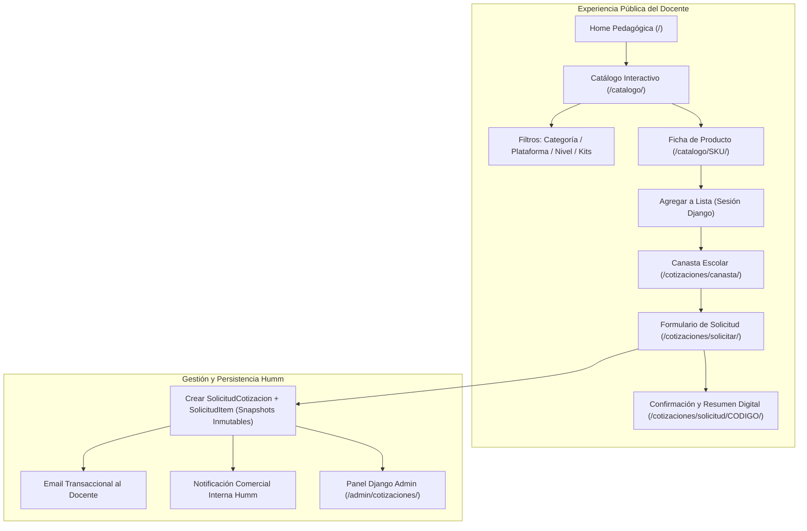

# PLAN DE IMPLEMENTACIÓN — FASE 4
## Front-end Comercial, Experiencia del Profesor, Catálogo Público y Solicitud de Cotización Escolar
### Plataforma EduCompra Humm (`educompra.humm.cl`)

**Documento:** `implementation_plan_fase_4.md`  
**Fecha de Elaboración:** 29 de Septiembre de 2026  
**Responsable Técnico:** Antigravity (Google DeepMind Pair Programmer)  
**Destinatario:** Equipo Directivo, Comercial y Pedagógico de Humm  
**Estado:** **PROPUESTA PARA REVISIÓN Y APROBACIÓN PREVIA**

---

## 1. Contexto, Objetivos y Principios Rectores

### 1.1 Estado Inicial al Cierre de Fase 3
La Fase 3 concluyó con la aprobación definitiva y auditoría del catálogo educativo inicial:
* **Catálogo Maestro:** 929 productos físicos ingresados en SQLite.
* **Catálogo Curado Aprobado:** **72 productos** validados comercial y pedagógicamente (`estado_curaduria = 'VALIDADO'`).
* **Catálogo Latente / Descartado:** 854 productos en reserva (`SIN_REVISAR`) y 3 productos excluidos (`DESCARTADO_CATALOGO_PUBLICO`).
* **Catálogo Público:** **0 productos publicados** (`publicado = False` en los 929 registros).
* **Especificaciones Neutras:** **0 validadas** (`estado_especificacion_neutral = 'NO_REVISADO'`). Candado `puede_generar_cotizacion_formal() == False` activo.
* **Compatibilidad y Seguridad:** Separación de tecnologías verificadas vs. propuestas y advertencias de uso educativo (`advertencia_uso`) en 11 productos críticos.
* **Consistencia:** 100% coincidencia entre [`CATALOGO_CURADO_FASE_3.md`](file:///Users/rmerinog/PLATAFORMAS/EDUCOMPRA/CATALOGO_CURADO_FASE_3.md) y base de datos, auditado con `auditar_consistencia_curaduria` y 24 tests pasando.

---

### 1.2 Objetivo General de la Fase 4
Construir y desplegar el **Front-end Comercial y Pedagógico** de EduCompra Humm en [https://educompra.humm.cl](https://educompra.humm.cl), permitiendo a los profesores, directivos y encargados de compras escolares:
1. **Explorar el catálogo curado de 72 productos** mediante filtros pedagógicos intuitivos (categoría, plataforma, nivel escolar y kit).
2. **Consultar fichas técnicas y pedagógicas claras**, con fotografías reales, desglose de empaque (unidad, pack o set), precios referenciales en CLP y advertencias de uso educativo.
3. **Seleccionar productos y armar una canasta escolar** de insumos de manera fluida y sin requerir registro previo de usuario.
4. **Enviar una Solicitud de Cotización formal** con los datos de su establecimiento educacional para gestión comercial por el equipo de Humm.

---

### 1.3 Los 6 Principios Rectores de la Experiencia Docente
1. **Cero Fricción para el Profesor:** El docente debe poder explorar, comparar y armar su lista de materiales sin necesidad de crear cuenta ni recordar contraseñas.
2. **Lenguaje Pedagógico Honesto:** Fichas redactadas para docentes de aula (enfoque en qué permite aprender, qué proyectos viabiliza y qué riesgos formativos considerar), sin jerga técnica opaca de importación.
3. **Claridad Comercial en Moneda Local:** Precios expresados transparentemente en pesos chilenos (CLP), distinguiendo precio neto y precio con IVA, indicando claramente la unidad de empaque (pack de 3, pack de 4, set de cables o unidad individual).
4. **Seguridad Escolar Visible:** Las advertencias de seguridad física (gases, 2 relés, medición eléctrica de baja tensión, pulso no médico, polaridad de baterías) deben destacarse visualmente en la ficha y en la canasta.
5. **Transparencia en Compra Pública:** El cotizador comercial opera para los 72 productos. Si el colegio requiere bases técnicas para Mercado Público / Ley 19.886, el sistema informa con transparencia que la ficha neutral está en proceso y será emitida con validación documental individual (`VALIDADO_HUMM`) por el equipo Humm.
6. **Rendimiento y Responsividad:** Navegación ultra rápida (carga inicial < 1s), optimizada para teléfonos móviles y tablets de docentes en la sala de clases.

---

## 2. Arquitectura de Módulos de la Fase 4



---

## 3. Detalle de Módulos e Implementación

### Módulo 1: Activación Controlada del Catálogo Público
* **Regla Estricta:** Publicar **únicamente los 72 productos validados** de Fase 3:
  ```python
  Producto.objects.filter(estado_curaduria='VALIDADO').update(publicado=True)
  ```
* **Blindaje:** Los 857 productos restantes (`SIN_REVISAR` y `DESCARTADO_CATALOGO_PUBLICO`) se mantienen obligatoriamente con `publicado = False`.
* **Comando de Gestión:** `python manage.py activar_catalogo_publico_fase_4`.
* **Verificación:** Pruebas automatizadas que confirmen que exactamente 72 productos son accesibles en vistas públicas y que cualquier intento de acceso directo por URL a un producto despublicado retorne `HTTP 404 Not Found`.

---

### Módulo 2: Navegación y Filtros Pedagógicos (`apps/catalogo`)

#### A. Página Principal / Home Pedagógica (`/`)
* **Hero Section:** Propuesta de valor de EduCompra Humm: *"Insumos de computación física, robótica y sensores seleccionados para colegios en Chile"*.
* **Grid de las 11 Categorías Oficiales:**
  Tarjetas interactivas con ícono, nombre formativo y contador de productos curados disponibles.
* **Sección de Kits y Componentes Destacados:** Acceso rápido a soluciones integrales para talleres escolares.
* **Buscador Rápido:** Barra de búsqueda integrada en la cabecera.

#### B. Catálogo Interactivo (`/catalogo/`)
* **Grid de Productos Responsive:**
  * Tarjeta de producto con:
    * Fotografía optimizada (con soporte para placeholder institucional si aplica).
    * Nombre comercial amigable Humm.
    * Badge de Categoría docente.
    * Chips de Compatibilidad Tecnológica Verificada (Arduino, micro:bit, ESP32, Raspberry Pi).
    * Badge de Nivel de Complejidad (`Inicial`, `Intermedio`, `Avanzado`).
    * Indicación explícita de Unidad de Empaque (ej: *Pack de 3 unidades*, *Set de 120 cables*, *Unidad*).
    * Precio sugerido total con IVA en CLP y precio neto referencial.
    * Botón de acción rápida: *"Ver detalle"* y *"Agregar a cotización"*.
* **Barra Lateral de Filtros (Desktop) / Drawer Colapsable (Móvil):**
  * **Categoría:** Selección individual o múltiple de las 11 categorías.
  * **Plataforma Compatible:** Filtro por tecnología (Arduino, micro:bit, Raspberry Pi, ESP32).
  * **Nivel Educativo:** Básico/Primaria (`INICIAL`), Medio/Secundaria (`INTERMEDIO`), Técnico-Profesional (`AVANZADO`).
  * **Aptitud para Kits:** Switch *"Apto para armar kits de aula"*.
  * **Rango de Precios en CLP:** Filtro por presupuesto disponible.
* **Ordenamiento:**
  * Menor a mayor precio
  * Mayor a menor precio
  * Nombre comercial A–Z
  * Recomendados para aula

#### C. Ficha de Producto Pedagógica (`/catalogo/<sku_proveedor>/`)
* **Galería Fotográfica:** Imagen principal en alta resolución con miniaturas navegables.
* **Cabecera Comercial:**
  * Nombre comercial honesto y descriptivo.
  * SKU Humm y SKU de proveedor para trazabilidad.
  * Precios destacados en CLP: **Precio Total con IVA** (destacado) y **Precio Neto**.
  * Empaque real explicitado (unidad, pack de 3/4, set de 2/3 piezas, 120 cables).
* **Bloque de Compatibilidad Diferenciada:**
  * **Compatibilidad Verificada (Fabricante):** Plataformas documentadas oficialmente.
  * **Recomendación Pedagógica Humm:** Sugerencias curriculares de integración en el colegio.
* **Caja de Advertencia de Uso Educativo (`advertencia_uso`):**
  * Bloque de alerta visualmente destacado (ámbar) para los 11 productos con requerimientos de seguridad:
    * Sensores MQ de gas: fin didáctico, no reemplaza detectores certificados.
    * Sensor de llama: óptica experimental escolar, no alarma de incendio.
    * Sensor de pulso: señales biológicas didácticas, **no es dispositivo médico**.
    * Módulo de 2 Relés: cargas de baja tensión escolar (5V/12V), tensión 220V no manipulable por alumnos.
    * Multímetros: circuitos educativos de baja tensión (hasta 24V).
    * Chasis y fuentes: comprobación de polaridad de baterías y protoboard.
* **Contenido Pedagógico Humm:**
  * *¿Qué es y para qué sirve en el aula?*
  * *¿Qué habilidades permite desarrollar?* (Pensamiento computacional, ciencias, cinemática, etc.).
  * *Posibles Proyectos Escolares:* 2 o 3 ejemplos prácticos aplicados a la realidad chilena.
* **Selector de Cantidad y Botón de Adición:**
  * Selector numérico interactivo (+ / -).
  * Botón *"Agregar a mi lista de cotización"*.
  * Feedback visual inmediato (toast/notificación flotante sin recargar la página).

---

### Módulo 3: Canasta Escolar / Selección de Productos (`apps/cotizaciones`)

#### A. Arquitectura de Sesión
* **Almacenamiento:** Sesión nativa de Django (`request.session['canasta']`), serializada en formato JSON limpio:
  ```python
  {
      "KS0486": {"cantidad": 2, "precio_neto": "22615.00", "precio_total": "26912.00"},
      "KS0034": {"cantidad": 5, "precio_neto": "8456.00", "precio_total": "10063.00"},
  }
  ```
* **Sin Registro Previo:** El docente agrega productos inmediatamente. No se solicitan contraseñas ni validaciones de cuenta en esta etapa.
* **Widget / Drawer de Canasta:**
  * Contador numérico flotante en la barra de navegación superior (ej: `Cotización (7)`).
  * Panel desplegable lateral que permite ver los productos agregados sin salir del catálogo.

#### B. Vista Completa de Canasta (`/cotizaciones/canasta/`)
* **Tabla de Ítems:**
  * Miniatura del producto.
  * Nombre comercial y categoría.
  * Unidad de compra / empaque (ej: *Pack de 3 unidades*).
  * Cantidad editable con actualización reactiva (+ / - / eliminar).
  * Precio unitario referencial y subtotal por ítem.
* **Resumen Financiero Escolar:**
  * Subtotal Neto (CLP).
  * IVA (19%).
  * **Total Estimado con IVA (CLP)**.
* **Avisos Informativos:**
  * *"Precios referenciales para compras escolares y presupuestos institucionales."*
  * *"Despacho a todo Chile continental."*
* **Llamado a la Acción:** Botón prominente *"Continuar con los datos del colegio"*.

---

### Módulo 4: Formulario y Motor de Solicitud de Cotización

#### A. Formulario de Solicitud (`/cotizaciones/solicitar/`)
Diseñado para la realidad administrativa de los colegios chilenos:

1. **Datos del Docente / Solicitante:**
   * Nombre completo y Apellidos.
   * Correo electrónico (preferentemente institucional).
   * Teléfono de contacto / WhatsApp (para coordinación rápida de despacho).
   * Cargo o Rol en el colegio:
     * *Profesor/a de Asignatura (Tecnología, Ciencias, Matemáticas)*
     * *Encargado/a de Taller o Laboratorio de Robótica/STEAM*
     * *Coordinador/a de Informática / Enlaces*
     * *Jefe/a de Unidad Técnica Pedagógica (UTP)*
     * *Encargado/a de Adquisiciones / Administrador / DAEM*
2. **Datos del Establecimiento Educacional:**
   * Nombre del Colegio o Escuela.
   * Dependencia administrativa:
     * *Municipal / Servicio Local de Educación Pública (SLEP)*
     * *Particular Subvencionado*
     * *Particular Pagado*
     * *Educación Superior / Técnico-Profesional (TP / CFT)*
   * Región y Comuna (selectores dinámicos de Chile).
   * RUT del Colegio o de la Institución Sostenedora (opcional).
3. **Contexto del Proyecto Pedagógico:**
   * Destino de los materiales: *Taller extracurricular, Clases de tecnología regulares, Proyecto de ciencias, Equipamiento de laboratorio, Reposición anual*.
   * Fondo proyectado de financiamiento: *Subvención Escolar Preferencial (SEP), Pro-Retención, Fondos Propios del Colegio, Mantenimiento, Subvención General, Fondos de Innovación Mineduc*.
4. **Opción de Compra Pública / Mercado Público:**
   * Checkbox explicativo:
     > *"¿Requiere que esta cotización sea tramitada a través de Mercado Público (Convenio Marco / Compra Ágil / Licitación Menor)?"*
   * Mensaje de transparencia Humm:
     > *"EduCompra Humm preparará los antecedentes comerciales y, en caso de requerir compra pública, nuestros ingenieros verificarán las especificaciones técnicas neutrales correspondientes según la normativa de compras públicas vigentes."*

#### B. Procesamiento y Persistencia Atómica
Al enviar el formulario:
1. Se genera un registro en [`SolicitudCotizacion`](file:///Users/rmerinog/PLATAFORMAS/EDUCOMPRA/apps/cotizaciones/models.py):
   * Código de seguimiento correlativo único: `SOL-2026-XXXX`.
   * Estado inicial: `nueva`.
   * Total referencial calculado.
2. Se generan los registros en [`SolicitudItem`](file:///Users/rmerinog/PLATAFORMAS/EDUCOMPRA/apps/cotizaciones/models.py):
   * **Snapshot inmutable:** Se congelan el SKU Humm, SKU proveedor, nombre comercial, unidad de empaque, precio unitario referencial vigente y subtotal.
   * Esto blinda el presupuesto ante eventuales cambios futuros en los precios del catálogo maestro.
3. Se limpia la sesión de la canasta.
4. Se despachan las notificaciones por correo:
   * **Al Docente:** Correo de confirmación con el detalle de los insumos cotizados, montos referenciales y código de seguimiento.
   * **Al Equipo Comercial Humm:** Alerta inmediata con datos del colegio y contacto telefónico para seguimiento comercial.

---

### Módulo 5: Vista de Confirmación y Comprobante Imprimible

#### A. Página de Éxito (`/cotizaciones/solicitud/<codigo_seguimiento>/`)
* Mensaje de éxito claro: *"¡Solicitud de cotización recibida con éxito!"*
* Código de seguimiento destacado en caja de alta visibilidad (ej: `SOL-2026-F4B2`).
* Explicación de los próximos pasos:
  1. *Revisión de stock y tiempos de internación por el equipo Humm (24 a 48 hrs hábiles).*
  2. *Envío de cotización formal timbrada con validez de 30 días.*
  3. *Coordinación para emisión de Factura, Orden de Compra o publicación en Mercado Público.*

#### B. Comprobante Digital Imprimible / PDF
* Botón *"Imprimir o Guardar en PDF"*.
* Hoja de estilo adaptada para impresión (`@media print`):
  * Membrete formal de EduCompra Humm (RUT de la empresa, dirección, contacto, logo institucional).
  * Tabla limpia de insumos, cantidades, códigos, precios y totales.
  * Espacio formal para visto bueno de UTP o Administración del Colegio.

---

### Módulo 6: Gestión Administrativa de Cotizaciones (`apps/cotizaciones/admin.py`)

* **Listado de Solicitudes:**
  * Columnas: Código de seguimiento, Fecha, Colegio, Comuna, Región, Solicitante, Total Estimado CLP, Estado.
  * Filtros por Estado (`nueva`, `en_revision`, `cotizacion_enviada`, `esperando_proceso_compra`, `adjudicada`, `cerrada`), Región, Dependencia y Fecha.
  * Búsqueda por código, nombre de colegio o solicitante.
* **Edición de Solicitud:**
  * Tabla inline con los ítems de la solicitud (snapshots inmutables).
  * Campos de vinculación a Mercado Público (`id_compra_agil_mp`, `id_licitacion_mp`, `id_orden_compra_mp`).
  * Bitácora interna de seguimiento comercial (`notas_internas_humm`).
* **Exportación de Datos:**
  * Acción administrativa para exportar cotizaciones seleccionadas a planilla Excel/CSV.

---

## 4. Diseño Visual, Estética y Sistema de Componentes (Vanilla CSS)

En cumplimiento de las directrices de diseño de Humm, la interfaz de Fase 4 no utilizará librerías monolíticas ni Tailwind, sino **Vanilla CSS modular y moderno**:

* **Variables y Tokens de Diseño (`static/css/educompra.css`):**
  * *Color Primario:* Azul EduCompra Humm (`#0f4c81` / `#1e40af`).
  * *Color de Acento / Interacción:* Ámbar Escolar (`#f59e0b` / `#d97706`).
  * *Color de Alerta y Advertencia:* Amarillo Precaución (`#fef3c7` / `#92400e`).
  * *Color de Éxito:* Verde Aprobación (`#10b981` / `#065f46`).
  * *Fondo y Superficies:* Blanco puro (`#ffffff`) y Gris escolar suave (`#f8fafc`).
  * *Tipografía:* Sistema nativo de alta legibilidad (`Inter`, `-apple-system`, `BlinkMacSystemFont`, `Segoe UI`, `sans-serif`).
* **Componentes Clave a Diseñar:**
  * `ProductCard`: Tarjeta de producto con hover sutil, badge de categoría, foto optimizada, chips de compatibilidad y botón accesible.
  * `FilterSidebar`: Acordeón de filtros con checkboxes estilizados y conteo dinámico.
  * `CartDrawer`: Panel deslizante lateral con animación suave (`transform: translateX`).
  * `SafetyAlertBox`: Caja de advertencia educativa con borde ámbar e ícono de precaución formativa.
  * `QuoteForm`: Formulario escolar de dos columnas con validación en tiempo real de campos requeridos.
  * `PrintSheet`: Estilo de alta fidelidad para documentos impresos.

---

## 5. Estrategia de Pruebas Automatizadas para Fase 4

Se desarrollará un nuevo conjunto de pruebas unitarias e integradas en `apps/catalogo/tests/test_vistas_fase4.py` y `apps/cotizaciones/tests/test_flujo_cotizacion.py`:

| Suite de Pruebas | Casos a Verificar |
| :--- | :--- |
| **Pruebas de Catálogo Público** | 1. Exactamente 72 productos retornan `HTTP 200` en catálogo público.<br>2. Productos despublicados retornan `HTTP 404` al intentar acceder directamente.<br>3. Filtros por categoría retornan la cantidad exacta de productos curados.<br>4. Filtro por plataforma compatible (`Arduino`, `micro:bit`, etc.) funciona correctamente.<br>5. Búsqueda por texto arroja resultados pertinentes. |
| **Pruebas de Ficha de Producto** | 1. Ficha despliega precios en CLP netos y con IVA calculados correctamente.<br>2. Ficha muestra compatibilidad verificada separada de propuesta.<br>3. Productos con `advertencia_uso` despliegan la caja de alerta obligatoria.<br>4. Productos sin advertencia no muestran la caja vacía. |
| **Pruebas de Canasta en Sesión** | 1. Agregar producto a la sesión actualiza el contador.<br>2. Modificar cantidad recalcula el subtotal en CLP.<br>3. Eliminar producto actualiza la canasta.<br>4. Intentar agregar un producto con `publicado = False` es rechazado. |
| **Pruebas de Solicitud de Cotización** | 1. Envío de formulario válido crea `SolicitudCotizacion` y congela `SolicitudItem` con snapshots inmutables.<br>2. Cálculo del total estimado con IVA es exacto al peso.<br>3. La sesión de canasta se limpia tras el envío exitoso.<br>4. Página de confirmación muestra código amigable `SOL-2026-XXXX`. |

---

## 6. Plan de Trabajo y Puntos de Control Fase 4

Para garantizar una ejecución ordenada y validada por la Dirección de Humm, la Fase 4 se dividirá en 4 hitos secuenciales:

```
┌────────────────────────────────────────────────────────────────────────┐
│                      SECUENCIA DE EJECUCIÓN FASE 4                     │
├─────────┬──────────────────────────────────────────────────────────────┤
│ Hito 1  │ Activación de los 72 productos y Catálogo Público Base       │
│         │ - Publicación exclusiva de los 72 productos validados        │
│         │ - Vista de Catálogo interactivo y filtros pedagógicos        │
├─────────┼──────────────────────────────────────────────────────────────┤
│ Hito 2  │ Fichas de Producto y Advertencias Educativas                 │
│         │ - Fichas detalladas con fotos reales y empaque claro         │
│         │ - Bloque de compatibilidad verificada vs. propuesta          │
│         │ - Cajas de advertencia de seguridad formativa                │
├─────────┼──────────────────────────────────────────────────────────────┤
│ Hito 3  │ Canasta Escolar y Formulario de Solicitud de Cotización      │
│         │ - Carrito en sesión sin fricción para el docente             │
│         │ - Formulario de solicitud adaptado a colegios chilenos       │
│         │ - Congelamiento de snapshots inmutables en base de datos     │
├─────────┼──────────────────────────────────────────────────────────────┤
│ Hito 4  │ Resumen Digital, Verificación en Producción y Cierre Fase 4  │
│         │ - Comprobante imprimible / PDF                               │
│         │ - Suite de tests completa (35+ tests)                        │
│         │ - Despliegue en educompra.humm.cl y entrega de informe       │
└─────────┴──────────────────────────────────────────────────────────────┘
```

---

## 7. Criterios de Aceptación para la Finalización de Fase 4

Al finalizar la Fase 4, se deberán cumplir los siguientes criterios verificables:
1. **72 productos visibles en el catálogo público** de [https://educompra.humm.cl](https://educompra.humm.cl) (`publicado = True`).
2. **857 productos del catálogo maestro estrictamente privados** (`publicado = False`).
3. **0 especificaciones neutras en `VALIDADO_HUMM`** sin revisión documental previa individual.
4. **Filtros pedagógicos 100% operativos** (las 11 categorías, tecnologías compatibles y niveles).
5. **Cajas de advertencia de seguridad visibles** en los 11 productos críticos.
6. **Canasta de cotización funcional** en sesión de usuario sin requerir registro previo.
7. **Formulario de solicitud operativo**, registrando solicitudes en base de datos con código de seguimiento y snapshots inmutables.
8. **Comprobante imprimible** generado limpiamente para el profesor.
9. **Suite de pruebas pasando al 100%** (24 tests existentes + nuevos tests de Fase 4).
10. **Despliegue operativo y verificado en HostGator** con entrega de `INFORME_IMPLEMENTACION_FASE_4.md`.

---

## 8. Solicitud de Autorización

El presente documento define la arquitectura, diseño visual y alcance técnico de la Fase 4.

> [!IMPORTANT]
> **No se iniciará la implementación de la Fase 4 hasta contar con la aprobación expresa de este plan por parte del Equipo Directivo de Humm.**
